## Instalação e interface 

### Introdução

Uma linguagem de programação é um método padronizado para comunicar instruções para um computador e o [R](https://www.r-project.org/about.html) é uma linguagem de programação especializada na comunicação de instruções para a manipulação, cálculo e visualização de dados. Formalmente o R é definido como uma linguagem e ambiente de programação estatística e produção de gráficos. Essa definição inclui o termo *ambiente* para indicar que o R é um sistema flexível, coerente e planejado; não apenas um conjunto de ferramentas estatísticas. Por outro lado, o R é um software gratuito, de código aberto e extensível. Isso quer dizer que não há que pagar para usá-lo (gratuito), a implementação das suas funções está disponível (código aberto), e os usuários podem acrescentar novas funções (extensível). A expressão [código aberto](https://pt.wikipedia.org/wiki/Software_de_c%C3%B3digo_aberto) indica que as instruções (código fonte) executadas por cada função são disponibilizadas sob uma licença de código aberto na qual o direito autoral fornece o direito de estudar, modificar e distribuir essas instruções de graça para qualquer um e para qualquer finalidade.

### Instalação

Na [página inicial do R](https://www.r-project.org/), o primeiro parágrafo contém o link [CRAN mirror](https://cran.r-project.org/mirrors.html). Ao seguir o link aparacerão outros links agrupados por países. Siga o link geograficamente mais próximo de você. Na página resultante aparecerão links para descarregar o R. Descarregue o R para o seu sistema operacional. Clique duas vezes no arquivo descarregado e siga as instruções. Embora seja possível escolher um língua de instalação diferente do inglês, eu recomendo a instalação em inglês. Por quê? Como veremos mais para frente, a execução de comandos pode produzir mensagens de erro e uma forma de encontrar a solução para um erro é copiar e colar e mensagem no Google. Ao fazermos a búsqueda em inglês, quase sempre teremos mais sucesso.  

### RStudio

O RStudio é uma companhia que oferece produtos gratuitos e pagos baseados no R. Os produtos gratuitos dão acesso a toda funcionalidade do R, e um desses, o RSudio Desktop, é uma interface que oferece recursos para facilitar o uso do R. No contexto da programação, produtos como o RStudio Desktop são conhecidos como IDE, pelas siglas em inglês de *ambiente de desenvolvimento integrado*. Para [descarregar o RStudio](https://www.rstudio.com/products/rstudio/download/) vá na seção **Installers for supported platforms**, escolha a opção para o seu sistema operacional, clique duas vezes no arquivo descarregado e siga as instruções.  

## Interface

Ao abrir o R no lugar do RStudio a interface será semelhante à seguinte:

  

Porém, a interface que usaremos não é essa e sim a do RStudio (ao abrir o programa, não confundir o ícone do RStudio com o do R).  

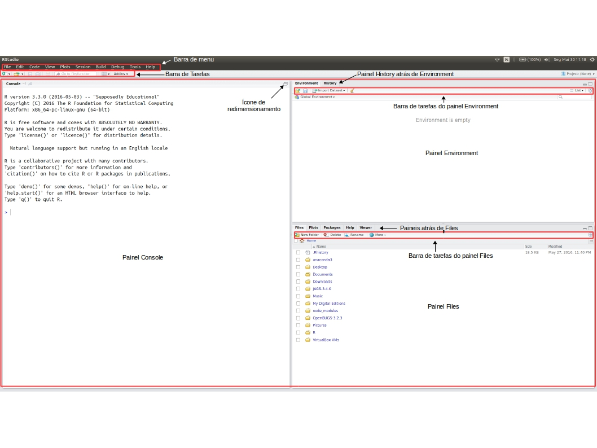  

A interface do RStudio, está composta por uma barra de menu, uma barra de tarefas, e painéis. A barra de menu contém janelas (*File, Edit, Code*, etc.) que ao ser clicadas oferecem múltiplas funcionalidades. A barra de tarefas está composta por ícones que executam funções frequentes (alguns abrem uma janela de opções) e quando o mouse é colocado sobre um desses ícones, aparece uma mensagem de texto que descreve a funcionalidade. Os painéis são os espaços que ocupam a maior parte da interface, e cada um, excetuando o painel *Console*, tem sua própria barra de tarefas. Cada painel também tem ícones no canto superior direito, que servem para colapsar ou redimensionar o painel.  

Como veremos em breve, o R permite escrever e executar códigos (instruções) diretamente na consola. Entretanto, os códigos podem ser escritos em arquivos com extensão ".R" e enviados à consola para serem executados. A vantagem disso é que os códigos podem ser guardados e executados quando necessário, sem necessidade de reescrevê-los. Esses arquivos se conhecem como *scripts*. Para abrir um novo script, basta clicar no primeiro ícone da barra de tarefas e clicar na primeira opção, *R Script*.  

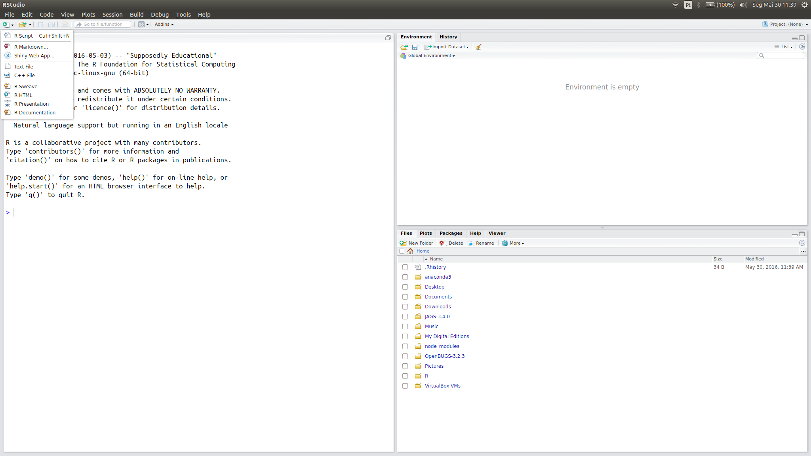  

No lado direito dessa opção aparece o atalho de teclado que abre um novo script. Assim, outra forma de abrir um novo script em Windows ou Linux é apertando simultaneamente as teclas *Ctrl+Shift+N* (o símbolo "+" não deve ser incluído, apenas idnica que as três teclas devem ser apertadas simultâneamente). Ainda, a janela *File* da barra de menu contém a opção *New File* que é equivalente ao primeiro ícone da barra de tarefas.  

O anterior exemplifica dois fenômenos comuns. Primeiro, a maioria das opções das barras de menu e de tarefas mostram um atalho de teclado para executar a funcionalidade em questão. Inicialmente, é trabalhoso lembrar os atalhos, mas com o tempo torna-se mais rápido e prático trabalhar com os mesmos (lembrar os atalhos é um bom investimento!). Segundo, geralmente há mais de uma forma para obter o mesmo resultado.  

Qualquer uma das possibilidades mencionadas abrirá um painel para mostrar o novo script.  

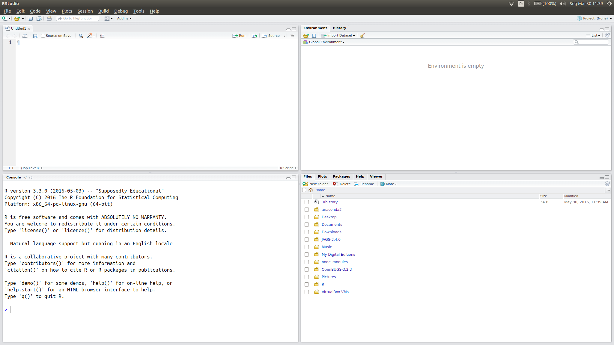  

Agora estamos prontos para continuar explorando a interface do RStudio e ao mesmo tempo começarmos a usar o R! Ao escrever `'Olá mundo'` na consola  

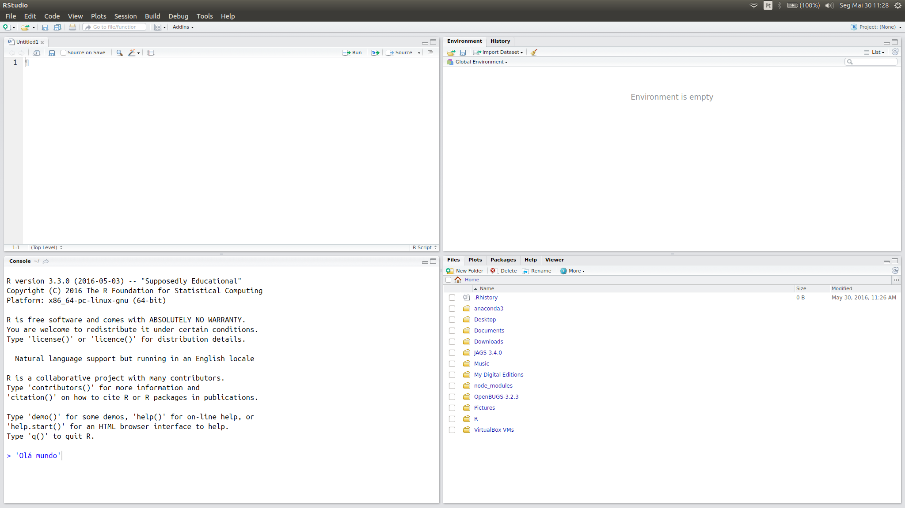  

e depois apertar *Enter*, o comando `'Olá mundo'` é executado.  

  

Se o comando é escrito no script  

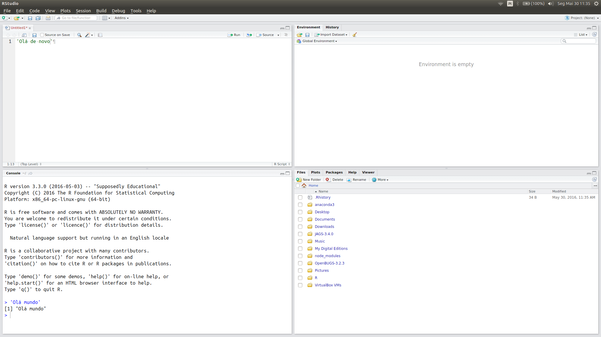  

a execução é feita posicionando o cursor na linha que contém o comando e apertando *Ctrl+Enter* (no Mac, Ctrl é usualmente substituído por Command).  

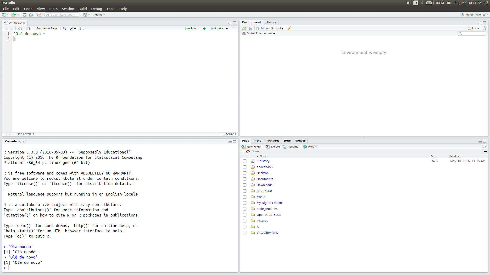  

De forma semelhante, podemos executar uma operação matemática.  

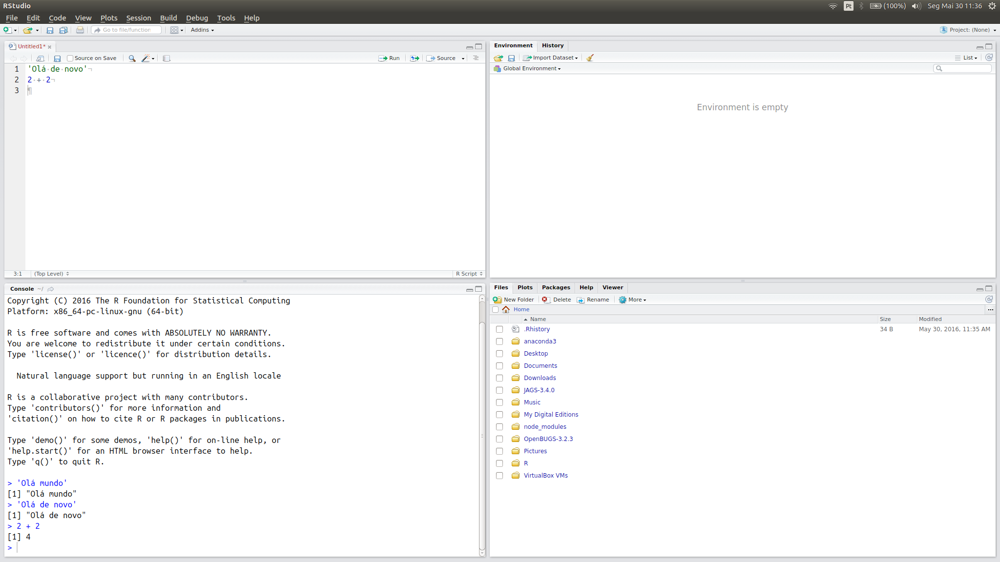  

Um tipo de operação importante é a desingação (assign). No exemplo a seguir, o comando `1:10` cria uma sequência de 1 a 10 e a armazena em um objeto nomeado `x`. O operador de designação `<-` armazena o que está à direita em um objeto que recebe o nome que está à esquerda (os nomes dos objetos podem conter, mas não começar com números). Assim, o comando `y <- 21:20` armazena a sequência 11 a 20 no objeto `y`.  

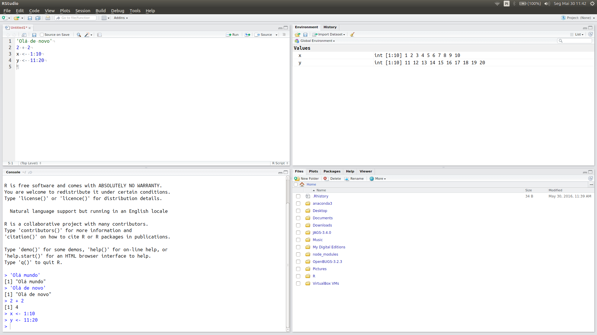  

Os dois comandos anteriores criaram dois objetos e todos os objetos são listados no painel *Environment*. Para imprimir o conteúdo de um objeto basta executar o nome. Vejamos esse comportamento com os objetos `x` e `y`, mas antes disso, limpemos a consola com o atalho \textit{Ctrl+L}.  

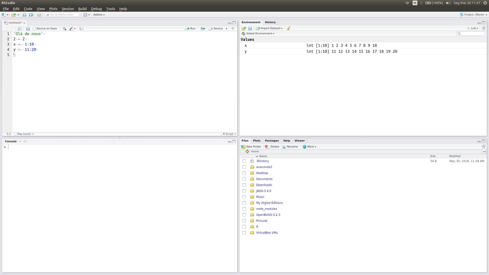  

Daqui para frente, o conteúdo de quadros cinza como o que está abaixo são os comandos executados, e os resultados da execução aparecerão em seguida precedidos por `##` ou serão gráficos.  


```r
> x <- 1:10
> y <- 11:20
```


```r
> x
```

```
 [1]  1  2  3  4  5  6  7  8  9 10
```

```r
> y
```

```
 [1] 11 12 13 14 15 16 17 18 19 20
```

A criação de um objeto e a impressão do seu conteúdo podem ser feitas simultaneamente se o comando é colocado entre paréntesis.  


```r
> (z <- 5:1)
```

```
[1] 5 4 3 2 1
```

Uma forma de imprimir vários objetos simultaneamente é colocando os nomes na mesma linha, mas separados por ";".  


```r
> x; y; z
```

```
 [1]  1  2  3  4  5  6  7  8  9 10
```

```
 [1] 11 12 13 14 15 16 17 18 19 20
```

```
[1] 5 4 3 2 1
```

Antes de explorarmos o painel *History*, vamos aprender umas poucas dicas. *Ctrl+1* posiciona o cursor no script e *Ctrl+2* posiciona o cursor na consola (vale a pena lembrar que existem muitos outros atalhos úteis e as janelas das barras de menu e de tarefas os mostram). Com o cursor na consola e apertando *Ctrl* mais a tecla com a flecha apontando para acima, abre-se uma janela com o histórico de comandos executados; ao digitar um ou vários caracteres, por exemplo `nom` e depois apertar *Ctrl* mais a flecha para acima, a janela só mostrará o histórico de comandos que começam com `nom` (se tivéssemos executado comandos para criar os objetos `nome_das_ruas` e `nome_dos_bairros` e nenhum outro comando tivesse começado por `nom`, so apareceriam esses dois comandos). O anterior ajuda a encontrar e reexecutar comandos prévios.  

Se executarmos o comando `x + y` e depois cliquamos na aba do painel *History*, veremos esse e todos os comandos executados até o momento.  

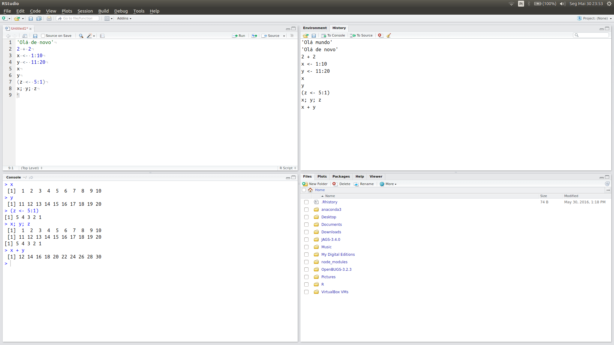  

A seleção de uma ou mais linhas do histórico junto com o uso do ícone *To Console*, envia as linhas respectivas à consola. O ícone *To Source* envia ao script.  

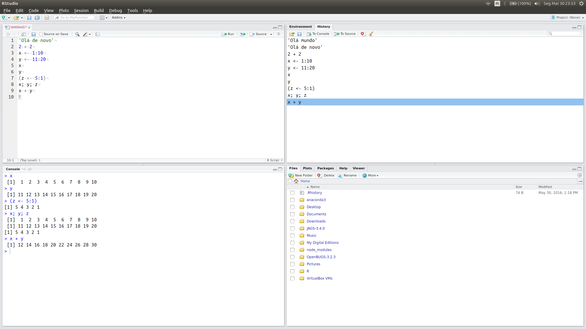  

O painel *Files* mostra os diretórios do computador. No caso de meu computador, vou entrar no diretório *Desktop* que está vazio, clicar no ícone *More* e depois na opção *Set as Working Directory*.  

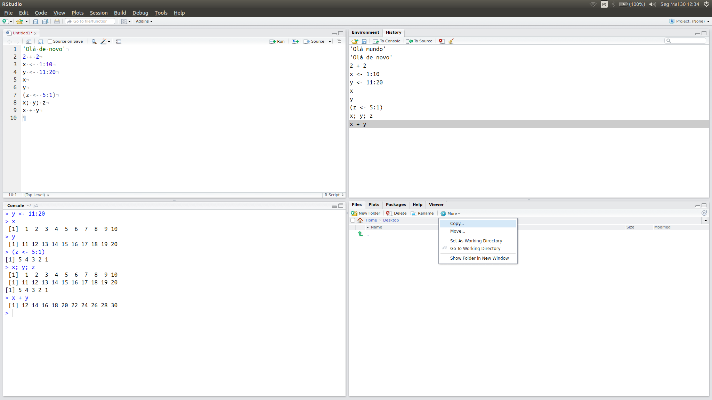  

Ao fixar o diretório de trabalho (*Working Directory*) no *Desktop*, a importação de arquivos presentes nesse diretório ou a exportação para o mesmo será mais fácil. Por exemplo, para salvar o meu script no diretório *Desktop*, só preciso usar o atalho *Ctrl+S* (ou o ícone de salvar na barra de tarefas) e digitar algum nome para o arquivo, digamos, *meu-primeiro-script*.  

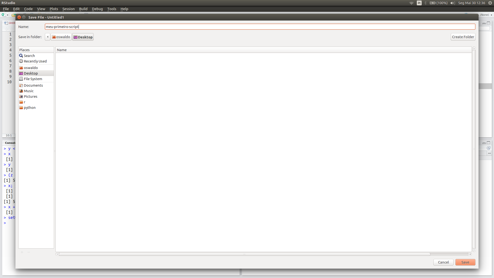  

Após isso, o arquivo aparecerá no *Desktop* e seu fechamento não apagará os objetos criados.  

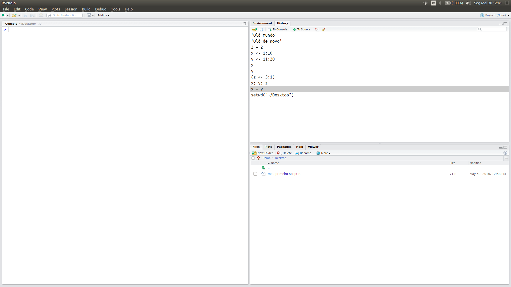  

De fato, podemos ir à consola, navegar no histórico e escolher e executar o comando `x; y; z`.  

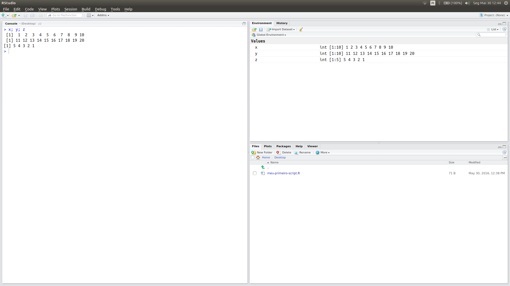  

Para apagar os objetos é preciso clicar no ícone da vassoura na barra de tarefas do painel *Environment*  

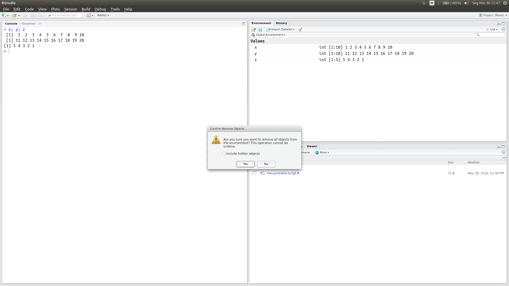  

e como é de se esperar, as tentivas de usar os objetos apagados gerarão erros.  

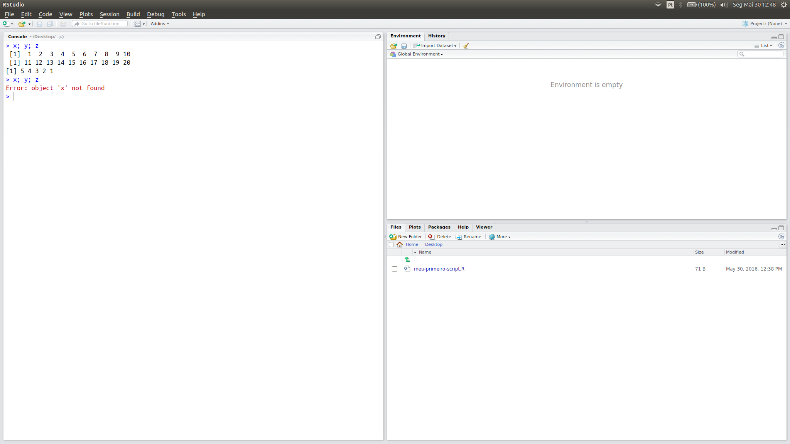  

Entretanto, o anterior não é problema, pois ao abrir o script (clicando nele no painel *Files*), selecionar todo, e executar o conteúdo, todos os objetos serão recriados.  

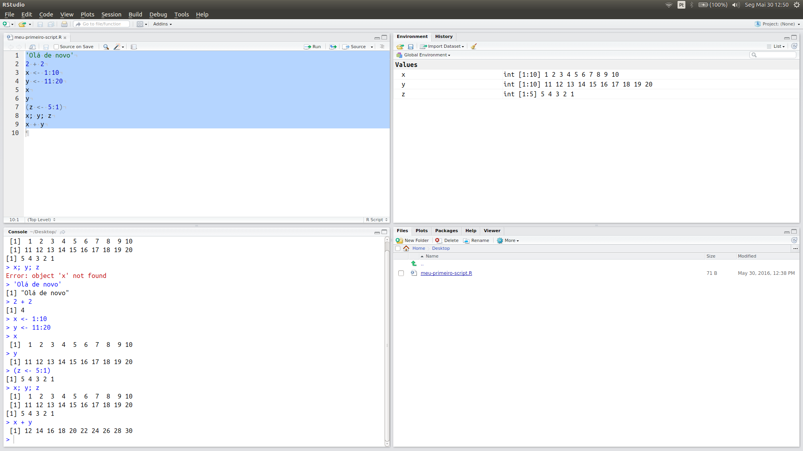  

Ao usar `x` e `y` como argumentos da função `plot`, o gráfico resultante aparecerá no painel *Plots*.  

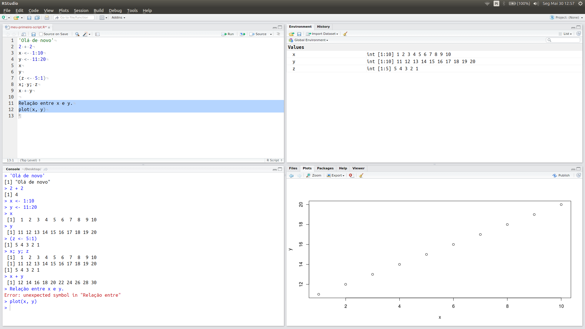  

Além do gráfico, a figura acima mostra que a execução da linha 11 do script gerou um erro. Porém, se essa linha começa com um ou mais "#", vira um *comentário* cujo conteúdo não é interpretado, apenas imprimido.  

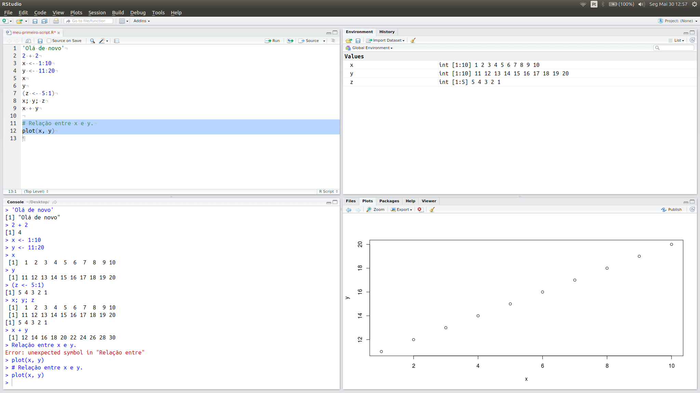

Os comentários são úteis para documentar um determinado código, pois embora no momento de criarmos o script possa ser desnecessário, ao revê-lo depois de um tempo a razão de ter usado o código pode não ser clara (obviamente um código simples como o anterior dispensa de comentários).  

O R organiza suas funções em *pacotes e para poder usá-las, os pacotes devem estar *carregados*. Alguns pacotes vêm com a instalação do R e são carregados automaticamente quando o R é iniciado; portanto, suas funções podem ser usadas diretamente como no caso do pacote *graphics* que contém a função `plot` usada anteriormente. Outros pacotes vêm com a instalação do R, mas não são carregados automaticamente e portanto, devem ser carregados antes de usar suas funções. Adicionalmente, existem pacotes que não vêm com a instalação do R, mas podem ser instalados e carregados. Nesse caso, a instalação só precisa ser feita uma vez, mas o carregamento deve ser feito cada vez que se inicia o R.  

Usando o pacote *maps* como exemplo, podemos ver que a tentativa de usar `map` - uma das suas funções - sem carregar o pacote, gerará um erro se o pacote não é previamente carregado.  


```r
> map('world')
```

```
Error in eval(expr, envir, enclos): could not find function "map"
```

Para instalar o pacote podemos executar o comando `install.packages('maps')` ou ir no painel *Packages*, clicar no ícone *install*, digitar *maps* na janela aberta, ativar a opção *Install dependencies*, e clicar *Install*.  

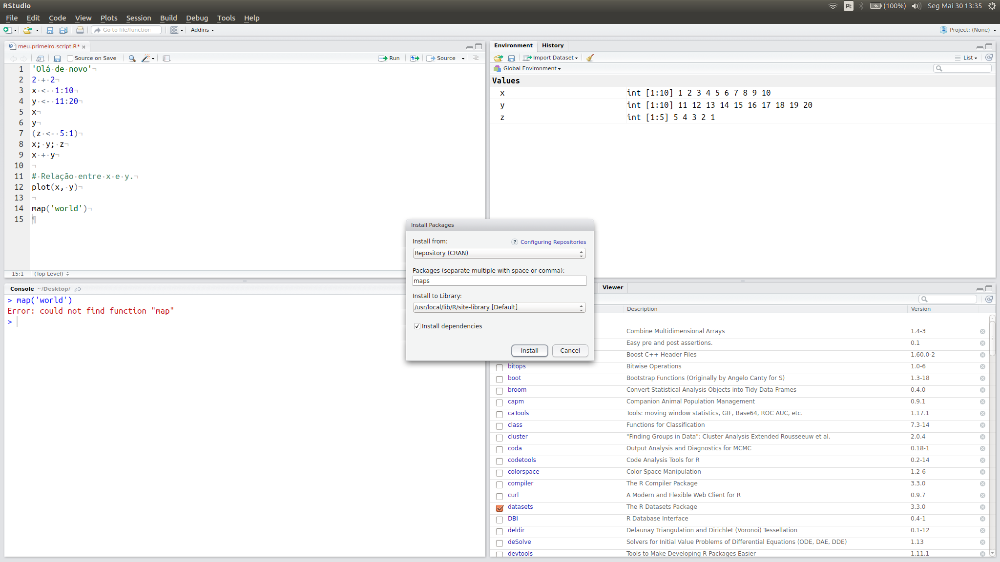  

O painel *Packages* também apresenta uma lista dos pacotes instalados e indica com o box da esquerda quais estão carregados (na imagem acima o *datasets* está carregado).  

Se instalação for bem sucedida, veremos que na consola as últimas linhas da mensagem de instalação são *The downloaded source packages are in ...*.   

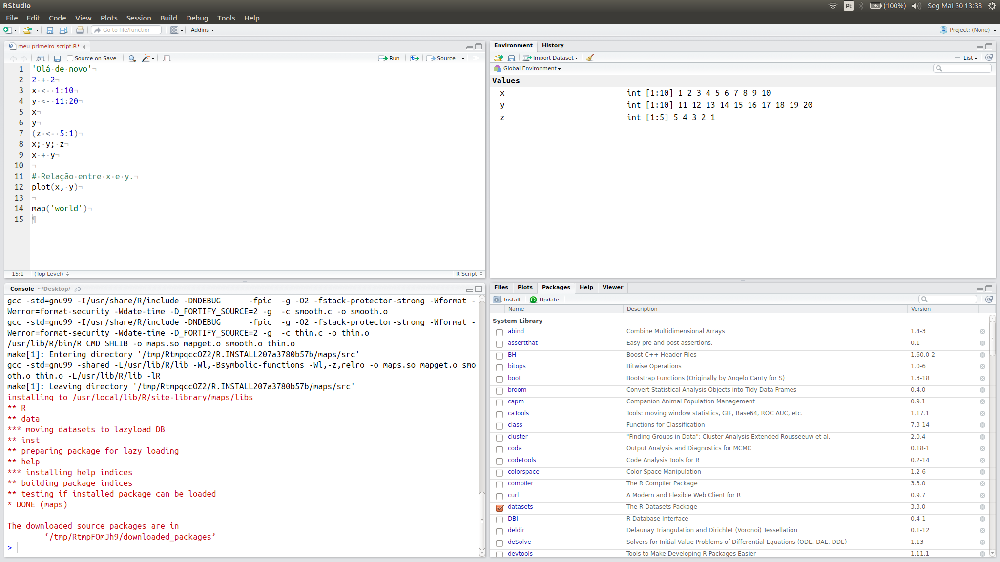  

Após a instalação, o pacote deve ser carregado com a função `library`, antes de executar a função `map`.  


```r
> library(maps)
```

```

 # maps v3.1: updated 'world': all lakes moved to separate new #
 # 'lakes' database. Type '?world' or 'news(package="maps")'.  #
```

```r
> map('world')
```


Deixando de lado os pacotes, podemos ver que o painel *Help* oferece uma série de materiais na sua página de início (ícone com o símbolo de uma casa).  

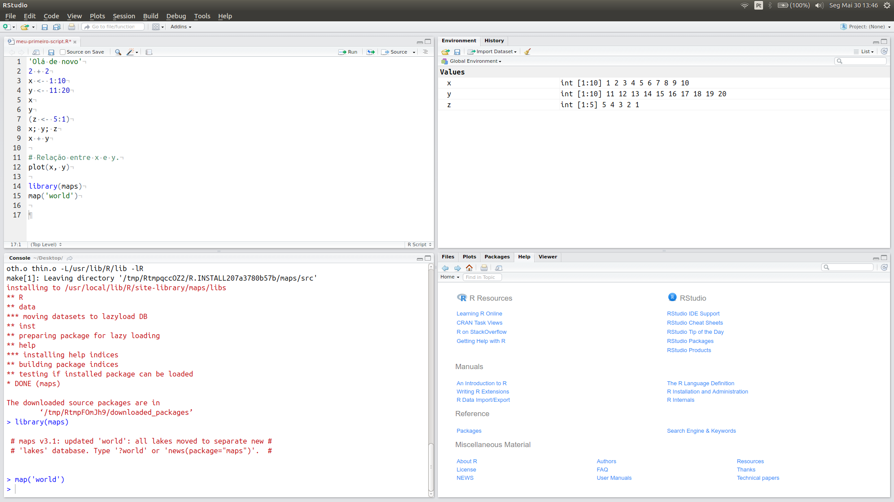  

Adicionalmente, a maioria das funções possui uma página de ajuda que pode ser visualizada nesse painel. Tomemos como exemplo a função `mean`. Ao digitar, `help(mean)` ou `?mean`, aparecerá a página de aujuda. Também podemos digitar `mean` e com o cursor no começo, no final ou sobre `mean`, apertar *F1*.  

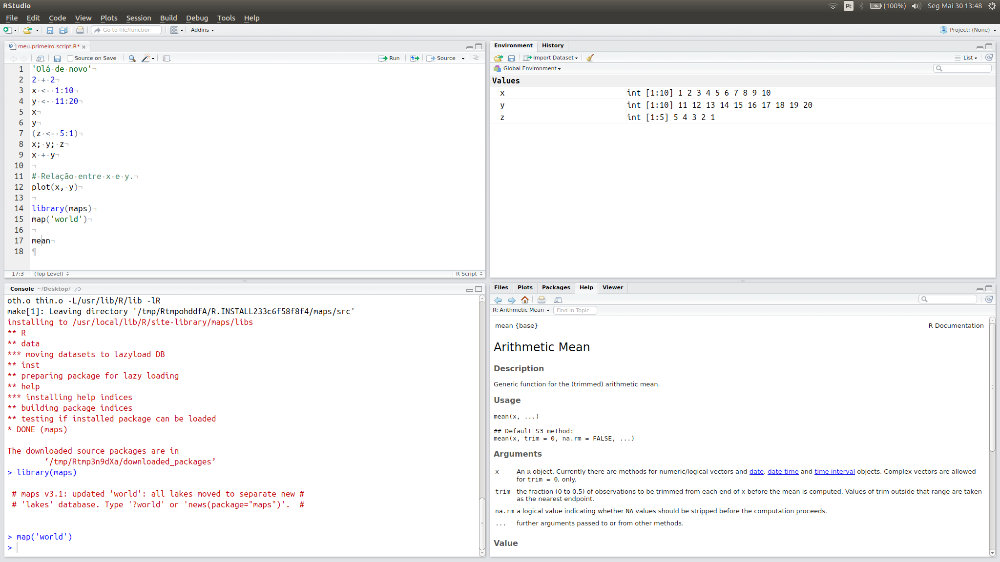  

As páginas de ajuda geralmente possuem uma descrição, uma seção *Usage* que mostra de forma condensada as diferentes formas de usar a função, uma seção *Arguments* que descreve os argumentos da função, uma seção *Value* que descreve os possíveis resultados gerados pela função, e uma seção *Examples* que apresenta códigos de exemplo (algumas páginas de ajuda tem outras seções). Inicialmente as páginas de ajuda são difíceis de entender porque estão escritas em linguagem técnica. No entanto, com o tempo é possível adquirir familiaridade com esse formato. Além dos recursos mencionados está o Google! Se digitarmos *r mean* no buscador, aparecerão várias páginas incluindo a própria página de ajuda da função. É bom olhar várias páginas, pois umas são mais amigáveis do que outras e combinando as informações de diferentes fontes, fica mais fácil entender o modo de uso.  

*Nota: o uso de termos de busca adequados é uma das ferramentas mais importantes para o uso proficiente do R e a escolha dos termos é uma habilidade que se aprimora com a prática.*  

Quando não sabemos exatamente o nome de uma função podemos executar parte do nome precedido por dois sinais de interrogação (`??mea`) para ver todas as páginas de ajuda que contém essa parte. Alternativamente, podemos digitar parte do nome no script ou na consola e apertar a tecla *TAB* para ver diferentes formas de autocompletar.  

O painel *Viewer* permite visualizar aplicações web locais, mas está além do propósito da presente introdução ao RStudio.  

Por fim vejamos uma poucas opções de configuração do script. Como mostra a linha 19 na figura abaixo, o comando se estende além do limite direito do painel do script.  

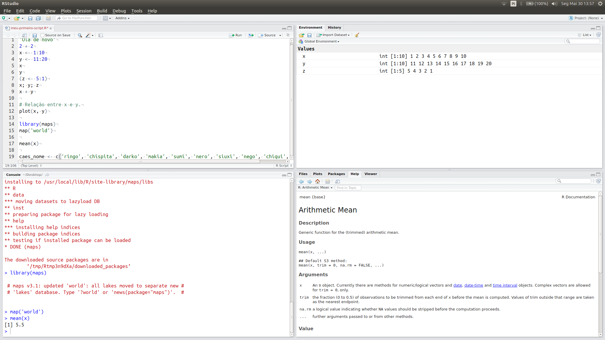  

Embora seja possível posicionar o mouse na divisião entre dois painéis e deslocar essa divisão,  

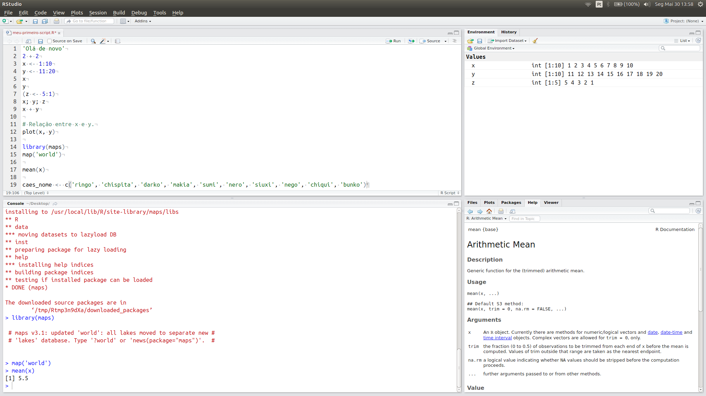  

podemos modificar a configuração do script para que a linha seja quebrada. Para isso, precisamos clicar na janela *Tools* da barra de menu e depois em *Global Options*, *Code*, e ativar a opção *Soft-wrap R source files*.  

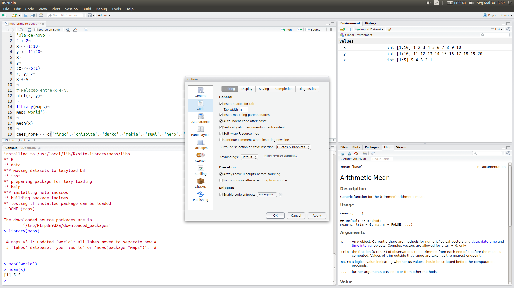  

Além disso, podemos visualizar uma margem que define uma largura de 80 caracteres, clicando em *Display* e ativando a opção *Show margin*.  

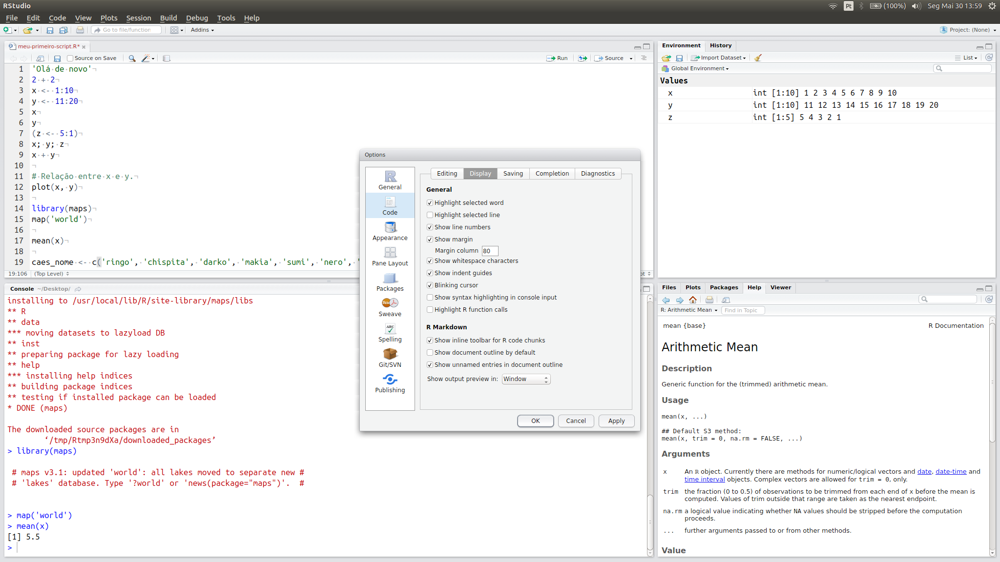  

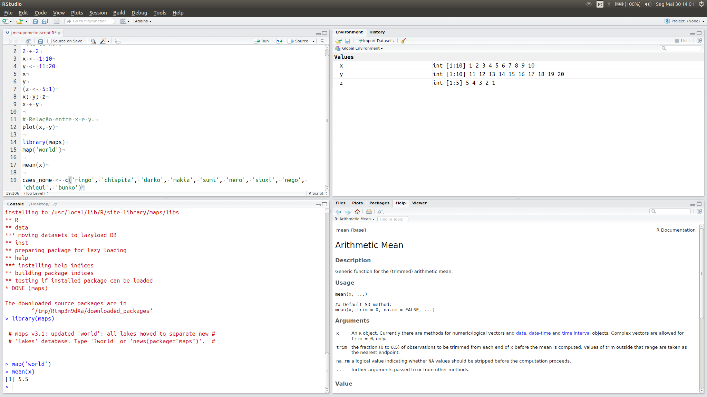  

Em programação, essa largura é um padrão. Para evitar que os comandos passem a margem como na figura acima, simplesmente devemos clicar *Enter* antes de sobrepassá-la. O lugar certo para dividir um comando é depois de uma vírgula ou de um operador matemático.  

  
