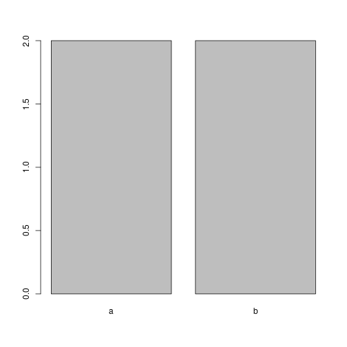
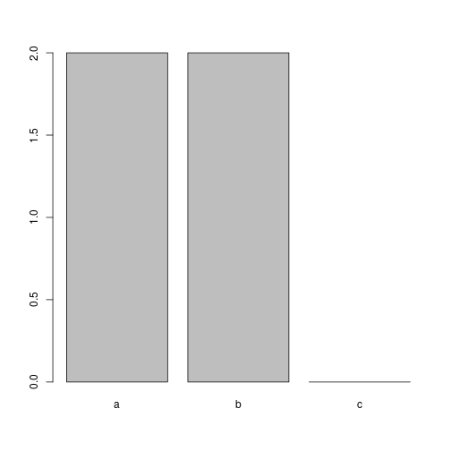

## Objetos

No R existem vários tipos de objetos que servem para armazenar e manipular dados. O tipo *integer* armazena números inteiros, o *double* números reais, o *character* caracteres (variáveis de texto), e o *logical* variáveis booleanas (variáveis que assumem os valores "falso" ou "verdadeiro"). A função `typeof` mostra o tipo de um dado objeto, e a página de ajuda dessa função apresenta os tipos de objetos existentes.  

Em muitas situações é irrelevante que um número inteiro seja representado como double ou como integer, porém, essa última representação é mais eficiente desde o ponto de vista computacional e portanto é mais conveniente em alguns casos em que os números inteiros não são usados em operações que resultam em números reais, e fazem parte de códigos que demandam bastantes recursos computacionais.  

No terceiro exemplo a seguir, o objeto é tipo *double*, apesar de não ter uma parte decimal explícita. Para definirmos um número inteiro como sendo do tipo *integer*, precisamos acrescentar a letra "L".  


```r
> typeof(1.1)
```

```
[1] "double"
```

```r
> typeof(1.0)
```

```
[1] "double"
```

```r
> typeof(1)
```

```
[1] "double"
```

```r
> typeof(1L)
```

```
[1] "integer"
```

```r
> typeof('1')
```

```
[1] "character"
```

```r
> typeof(TRUE)
```

```
[1] "logical"
```

```r
> typeof(FALSE)
```

```
[1] "logical"
```

Os objetos além de serem de um determinado tipo, possuem um modo, uma classe, e uma estrutura especifica determinada pelo número de dimensões, e pela homegeneidade do conteúdo em relação ao tipo dos seus elementos.

O modo também se refere ao armazenamento dos dados e é praticamente equivalente ao tipo. A função `mode` mostra o modo dos objetos.

A classe é uma propriedade dos objetos que determina o compartamento das funções aplicadas aos mesmos. Se criarmos um vetor (ver próxima secção) com dois números e outro com duas letras, as suas classes serão diferentes como mostrado pela função `class`, e algumas funções como `summary` terão um comportamento diferente para cada tipo.


```r
> c(1, 2)
```

```
[1] 1 2
```

```r
> c("a", "b")
```

```
[1] "a" "b"
```

```r
> class(c(1, 2))
```

```
[1] "numeric"
```

```r
> class(c("a", "b"))
```

```
[1] "character"
```

```r
> summary(c(1, 2))
```

```
   Min. 1st Qu.  Median    Mean 3rd Qu.    Max. 
   1.00    1.25    1.50    1.50    1.75    2.00 
```

```r
> summary(c("a", "b"))
```

```
   Length     Class      Mode 
        2 character character 
```

<br>
Estruturas de objetos segundo o número de dimensões e a homogeneidade dos seus elementos (adaptado de [Wickham, 2014](http://adv-r.had.co.nz/Data-structures.html)).  

| Dimensões | Homogênea | Heterogênea |
|---|---|---|
| 1 | Vetor atômico e Fator | Lista |
| 2 | Matriz |Data frame |
| n | Array |   |  

<br>
Com as estruturas anteriores é possível aplicar as seguintes operações:  

| Operação | Descrição |
|---|---|
| Criação | Do objeto em si |
| Inspecção | Exploração de atributos e da estrutura em si |
| Indexação | Seleção de um subconjunto de elementos |
| Substituição | Redefinição de um subconjunto de elementos |
| Reposicionamento | Alteração da ordem dos elementos |
| Eliminação | De um subconjunto de elementos |
| Combinação | De objetos com a mesma estrutura |
| Coerção | De uma tipo/estrutura para outro/a |

Em vetores, matrizes, arrays e data frames, também é possível aplicar operações matemátcias e lógicas.  

No presente capítulo não veremos a estrutura array, porque os exemplos de operações em matrizes são facilemente extrapoláveis. Por outro lado, veremos conceitos básicos de funções (objetos especiais que não se encaixam nas tabelas anteriores).  

### Vetor atômico

Os vetores atômicos armazenam um único tipo de dados, por exemplo, inteiro ou real, mas não ambos. Qualquer um dos exemplos anteriores é uma instância de um vetor atômico, o qual podemos verificr com a função `is.atomic`.  


```r
> is.atomic(1.1)
```

```
[1] TRUE
```

```r
> is.atomic(FALSE)
```

```
[1] TRUE
```

Daqui para frente chamaremos os vetores atômicos simplesmente de vetores, mas na apresentação de outra das estruturas, a lista, veremos que os conceitos vetor e vetor atômico não são estritamente iguais.  

#### Criação

Uma das principais formas para criar vetores com comprimento maior a 1, é usando a função `c`, que concatena objetos do mesmo tipo. Para vetores  com comprimento igual a 1, também podemos usar essa função, mas como vimos não é necessário.  


```r
> (casos <- c(42, 25))
```

```
[1] 42 25
```

```r
> c(1)
```

```
[1] 1
```

Além da função `c`, podemos usar outras funções que retornam vetores, como no caso da função `seq` que cria sequências.


```r
> seq(from = 1, to = 10)
```

```
 [1]  1  2  3  4  5  6  7  8  9 10
```

```r
> 1:10 # Equivalente ao comando anterior.
```

```
 [1]  1  2  3  4  5  6  7  8  9 10
```

```r
> seq(from = 1, to = 10, by = 2)
```

```
[1] 1 3 5 7 9
```

#### Atributos e estrutura

Os vetores têm um atributo chamado `name` quando os seus objetos possuem nome; caso contrário, o atributo é igual a `NULL`.  


```r
> attributes(casos)
```

```
NULL
```

```r
> casos2015 <- c(notificados = 42, autoctones = 25, importados = 5)
> attributes(casos2015)
```

```
$names
[1] "notificados" "autoctones"  "importados" 
```

O exemplo anterior também mostra uma característica da designação de nomes aos objetos. O nome `casos2015` é designado ao resultado da função `c` usando o símbolo "<-", mas os nomes `notificados`, `autoctones` e `importados` são designados dentro da função `c` usando o símbolo "=". Dentro das funções, o comportamento de "=" e "<-" é diferente, pois o uso do primeiro criará os objetos só dentro do ambiente da função, enquanto o uso do segundo criará esses objetos tanto no ambiente da função como no ambiente global (aparecerão no painel *Environment* do RStudio).  

A estrutura detalhada dos objetos pode ser inspecionada com a função `str`.  


```r
> str(casos)
```

```
 num [1:2] 42 25
```

O código acima mostra que `casos` é um vetor numérico (`num`) com dois elementos: 42 e 45. "Numérico" não é um tipo, é um *modo* que abrange os tipos inteiro e real.  


```r
> mode(1L)
```

```
[1] "numeric"
```

```r
> mode(1.1)
```

```
[1] "numeric"
```

`casos2015` é um vetor numérico nomeado com três elementos. Os nomes estão contidos no atributo `names` que é um vetor tipo caracter com três elementos.  

A comprimento dos vetores indica o número de objetos contidos.  


```r
> length(1.1)
```

```
[1] 1
```

```r
> length(casos)
```

```
[1] 2
```

#### Indexação

Para indexar um elemento específico de um vetor, podemos usar sua posição ou seu nome entre aspas.  


```r
> casos2015[2]
```

```
autoctones 
        25 
```

```r
> casos2015['autoctones']
```

```
autoctones 
        25 
```

Para selecionar dois ou mais elementos, devemos indicar as posições ou nomes dentro de um vetor ou mediante uma sequência de posições.  


```r
> casos2015[c('autoctones', 'importados')]
```

```
autoctones importados 
        25          5 
```

```r
> casos2015[c(2, 3)]
```

```
autoctones importados 
        25          5 
```

```r
> casos2015[2:3]
```

```
autoctones importados 
        25          5 
```

A indexação usando um vetor lógico é outra possibilidade.  


```r
> idades <- c(3, 7, 12, 4, 1, 5, 6)
> idades[c(TRUE, TRUE, FALSE, FALSE, FALSE, FALSE, FALSE)]
```

```
[1] 3 7
```

```r
> idades > 5
```

```
[1] FALSE  TRUE  TRUE FALSE FALSE FALSE  TRUE
```

```r
> idades[idades > 5]
```

```
[1]  7 12  6
```

```r
> idades[idades > 2 & idades < 7]
```

```
[1] 3 4 5 6
```

```r
> idades[idades < 4 | idades == 12]
```

```
[1]  3 12  1
```

Um elemento pode ser indexado mais de uma vez e a não especificação de nenhum elemento equivale a indexação de todos.  


```r
> idades[c(1, 1)]
```

```
[1] 3 3
```

```r
> idades[]
```

```
[1]  3  7 12  4  1  5  6
```

#### Substituição

Tudo o que pode ser indexado também pode ser substituído.


```r
> casos2015
```

```
notificados  autoctones  importados 
         42          25           5 
```

```r
> (casos2015['notificados'] <- 50)
```

```
[1] 50
```

Para substituir o nome de um elemento precisamos indexar o nome ou nomes a serem substituidos no resultado da função `names`.


```r
> names(casos2015)
```

```
[1] "notificados" "autoctones"  "importados" 
```

```r
> names(casos2015)[1] <- 'suspeitos'
> names(casos2015)
```

```
[1] "suspeitos"  "autoctones" "importados"
```

#### Reposicionamento

Para reposicionar os elementos, basta indexar na sequência desejada 


```r
> casos2015[c(1, 3, 2)]
```

```
 suspeitos importados autoctones 
        50          5         25 
```

e se queremos as novas posições em `casos2015`, devemos reassignar o nome.

```r
> (casos2015 <- casos2015[c(1, 3, 2)])
```

```
 suspeitos importados autoctones 
        50          5         25 
```

#### Eliminação

Ao indexar uma posição precedida pelo sinal "-", o elemento correspondente será removido.


```r
> casos2015[-1]
```

```
importados autoctones 
         5         25 
```

Para eliminar dois ou mais elementos, o sinal "-" deve preceder o vetor com os elementos a serem eliminados.


```r
> casos2015[-c(2, 3)]
```

```
suspeitos 
       50 
```

#### Combinação

A combinação de dois ou mais vetores equivale a concatenação dos mesmos.


```r
> c(c(1, 3), c(10, 20))
```

```
[1]  1  3 10 20
```

```r
> c(c(1, 3), c(10, 20), 5)
```

```
[1]  1  3 10 20  5
```

Como a função `append` há maior controle, pois podemos especificar, em que posição do primeiro vetor deve ser colocado o segundo.


```r
> append(c(1, 3), c(10, 20), after = 1)
```

```
[1]  1 10 20  3
```

#### Coerção

Dado que os vetores só podem ter um único tipo de objetos, a combinação de tipos diferentes resulta na coerção para um único tipo. Assim, no segundo comando do exemplo a seguir, o 1 passa a ser de tipo caracter.


```r
> typeof(c(1, 3))
```

```
[1] "double"
```

```r
> typeof(c(1, 'a'))
```

```
[1] "character"
```

Também há funções que coercionam de um tipo para outro quando é possível.


```r
> as.character(c(1, 3))
```

```
[1] "1" "3"
```

```r
> typeof(c(1L, 3L))
```

```
[1] "integer"
```

```r
> typeof(as.double(c(1L, 3L)))
```

```
[1] "double"
```

#### Operações

A seguinte tabela mostra operadores matemáticos comuns.

| Operador | Descrição | Exemplo |
|---|---|---|
| + | Soma | 10 + 5 |
| - | Subtração | 10 - 5 |
| * | Multiplicação  | 10 * 5 |
| / | Divisão | 10 / 5 |
| ^ | Exponenciação | 10 ^ 5 |
| exp | Exponenciação (base e) | exp(10) |
| log | Logaritmo | log(10) |
|     |           | log(10, base = exp(1)) |
|     |           | log(8, base = 2) |
| sqrt | Raíz quadrada | sqrt(64) |
| %/% | Resultado inteiro da divisão | 10 %/% 3 |
| %% | Módulo (resto) | 10 %% 3 |
| abs | Valor absoluto | abs(-10) |

Nas operações matemáticas a precedência dos operadores é: ^ > *, / > +, - > operadores lógicos. O contido entre parêntesis altera a precdência.   


```r
> 2 ^ 3 * 4
```

```
[1] 32
```

```r
> 2 ^ (3 * 4)
```

```
[1] 4096
```

```r
> 2 * 3 + 4
```

```
[1] 10
```

```r
> 2 * (3 + 4)
```

```
[1] 14
```

```r
> 2 + 3 == 5
```

```
[1] TRUE
```

Com dois ou mais vetores do mesmo comprimento (dois ou mais elementos), as operações matemáticas são feitas entre elementos de posições correspondentes. 


```r
> c(1, 3) + c(2, 4)
```

```
[1] 3 7
```

Se os vetores tem tamanhos diferentes, os elementos do mais curto são recilados.


```r
> c(10, 12, 14, 16) - c(2, 3)
```

```
[1]  8  9 12 13
```

Quando o comprimento do mais curto não é múltiplo dos outros vetores, continua havendo reciclagem, mas acompanhada de uma mensagem de aviso.


```r
> c(10, 12, 14) - c(2, 3)
```

```
Warning in c(10, 12, 14) - c(2, 3): longer object length is not a
multiple of shorter object length
```

```
[1]  8  9 12
```

As operações mediadas por funções são aplicadas a cada um dos elementos de um vetor.


```r
> sqrt(c(64, 100))
```

```
[1]  8 10
```

Existem funções que servem para realizar operações entre os elementos de um mesmo vetor.  


```r
> sum(c(2, 3, 5)) # Soma
```

```
[1] 10
```

```r
> cumsum(c(2, 3, 5)) # Soma acumulada
```

```
[1]  2  5 10
```

```r
> prod(c(2, 3, 5)) # Produto
```

```
[1] 30
```

```r
> cumprod(c(2, 3, 5)) # Produto acumulado
```

```
[1]  2  6 30
```

Mesmo quando não há uma função específica para uma dada operação entre os elementos de um vetor, podemos aplicar a operação mediante a função `Reduce`. No código a seguir, o operador de devisão "/", é aplicado aos dois primeiros elementos (100 / 2) e posteriormente, ao resultado (50) com o seguinte elemento (50 / 2).  


```r
> Reduce('/', c(100, 2, 2))
```

```
[1] 25
```

Como o operador / não é uma função convencional com argumentos entre parêntesis, deve ser colocado entre aspas. No caso de outras funções, as aspas são desnecessárias.


```r
> Reduce(sum, c(2, 3, 5)) # Equivalente a cumsum(c(2, 3, 5))
```

```
[1] 10
```

Os operadores lógicos servem para construir expresões lógicas cujo resultado é falso ou verdadeiro.


```r
> 3 < 5 # 3 menor do que 5?
```

```
[1] TRUE
```

```r
> 3 <= 5 # 3 menor o igual a 5?
```

```
[1] TRUE
```

```r
> 3 >= 5 # 3 maior ou igual a 5?
```

```
[1] FALSE
```

```r
> 3 > 5 # 3 maior do que 5?
```

```
[1] FALSE
```

```r
> 3 == 5 # 3 igual a 5?
```

```
[1] FALSE
```

```r
> 3 != 5 # 3 diferente de 5?
```

```
[1] TRUE
```

```r
> 3 > 4 & 5 > 4 # 3 e 5 são maiores do que 4?
```

```
[1] FALSE
```

```r
> 3 > 4 | 5 > 4 # 3 ou 5 são maiores do que 4?
```

```
[1] TRUE
```

```r
> a <- 1:3
> any(a > 2) # Algum dos valores em "a" é maior do que 12?
```

```
[1] TRUE
```

```r
> all(a > 2) # Todos os valores em "a" são maiores do que 12?
```

```
[1] FALSE
```

```r
> identical(c(1, 3), c(4, 5)) # Os dois vetores são iguais
```

```
[1] FALSE
```

```r
> c(1, 3, 5, 7) %in% c(4, 5, 6, 7) # Quais elementos do 1o vetor estão no 2o
```

```
[1] FALSE FALSE  TRUE  TRUE
```

As seguintes funções executam operações de conjuntos.


```r
> which(c(1, 2, 3, 4) > 2) # Quais elementos são maiores do que 2
```

```
[1] 3 4
```

```r
> union(x = 1:3, y = 3:5) # Quais elementeos estão em x ou em y
```

```
[1] 1 2 3 4 5
```

```r
> intersect(x = 1:3, y = 3:5) # Quais elementeos estão em x e em y
```

```
[1] 3
```

```r
> setdiff(x = 1:3, y = 3:5) # Quais elementeos de x não estão em y
```

```
[1] 1 2
```


### Matrizes

As matrizes também armazenam um único tipo de objetos, mas a diferença dos vetores, possuem duas dimensões: linhas e colunas.

#### Criação

A função `matrix` cria matrizes e nos dá a possibilidade de definir o número de linhas e de colunas.


```r
> matrix(1:6, ncol = 3)
```

```
     [,1] [,2] [,3]
[1,]    1    3    5
[2,]    2    4    6
```

```r
> matrix(1:6, nrow = 3)
```

```
     [,1] [,2]
[1,]    1    4
[2,]    2    5
[3,]    3    6
```

Por padrão, as posições são preenchidas por coluna, mas isso é controlado pelo argumento `byrow`.


```r
> matrix((1:6), ncol = 3, byrow = TRUE)
```

```
     [,1] [,2] [,3]
[1,]    1    2    3
[2,]    4    5    6
```

Cada linha ou coluna de uma matriz é um vetor e portanto outra forma de criar matrizes é combinando vetores do mesmo comprimento em linhas (com `rowbind`) ou em colunas (com `cbind`).


```r
> rbind(1:3, c(10, 20, 30))
```

```
     [,1] [,2] [,3]
[1,]    1    2    3
[2,]   10   20   30
```

```r
> cbind(1:3, c(10, 20, 30))
```

```
     [,1] [,2]
[1,]    1   10
[2,]    2   20
[3,]    3   30
```

```r
> is.matrix(cbind(1:3, c(10, 20, 30)))
```

```
[1] TRUE
```

#### Atributos e estrutura

As matrizes cujas linhas e colunas não têm nome, possuem um único atributo `dim` que indica o comprimento de cada dimensão. O primeiro valor indica o número de linhas e segundo o número de colunas.


```r
> (vacinados <- matrix(c(8, 5, 0, 13, 4, 1, 10, 6, 2), ncol = 3))
```

```
     [,1] [,2] [,3]
[1,]    8   13   10
[2,]    5    4    6
[3,]    0    1    2
```

```r
> attributes(vacinados)
```

```
$dim
[1] 3 3
```

As funções `rownames` e `colnames` nomeam as linhas e as colunas respectivamente.


```r
> rownames(vacinados) <- c('a', 'b', 'c')
> vacinados
```

```
  [,1] [,2] [,3]
a    8   13   10
b    5    4    6
c    0    1    2
```

```r
> colnames(vacinados) <- c('sim', 'nao', 'desconhecido')
> vacinados
```

```
  sim nao desconhecido
a   8  13           10
b   5   4            6
c   0   1            2
```

A função `dimnames` mostra os nomes dentro de cada uma das dimensões e a função `names` nomea as próprias dimensões.


```r
> dimnames(vacinados)
```

```
[[1]]
[1] "a" "b" "c"

[[2]]
[1] "sim"          "nao"          "desconhecido"
```

```r
> names(dimnames(vacinados)) <- c('grupo', 'vacinado')
> vacinados
```

```
     vacinado
grupo sim nao desconhecido
    a   8  13           10
    b   5   4            6
    c   0   1            2
```

A função `matrix` também tem o argumento `dimnames` que cria os nomes no momento em que a matriz é criada. Nesse argumento, os nomes devem ser definidos dentro da função `list`, que veremos posteriormente.


```r
> matrix(c(8, 5, 0, 13, 4, 1, 10, 6, 2), ncol = 3,
+        dimnames = list(c('a', 'b', 'c'), NULL))
```

```
  [,1] [,2] [,3]
a    8   13   10
b    5    4    6
c    0    1    2
```

```r
> matrix(c(8, 5, 0, 13, 4, 1, 10, 6, 2), ncol = 3,
+        dimnames = list(NULL, c('sim', 'nao', 'desconhecido')))
```

```
     sim nao desconhecido
[1,]   8  13           10
[2,]   5   4            6
[3,]   0   1            2
```

```r
> matrix(c(8, 5, 0, 13, 4, 1, 10, 6, 2), ncol = 3,
+        dimnames = list(c('a', 'b', 'c'), c('sim', 'nao', 'desconhecido')))
```

```
  sim nao desconhecido
a   8  13           10
b   5   4            6
c   0   1            2
```

```r
> matrix(c(8, 5, 0, 13, 4, 1, 10, 6, 2), ncol = 3,
+        dimnames = list(grupo = c('a', 'b', 'c'),
+                        vacinado = c('sim', 'nao', 'desconhecido')))
```

```
     vacinado
grupo sim nao desconhecido
    a   8  13           10
    b   5   4            6
    c   0   1            2
```

Quando pelo menos uma das dimensões tem nomes, as matrizes ganham o argumento `dimnames`.


```r
> attributes(vacinados)
```

```
$dim
[1] 3 3

$dimnames
$dimnames$grupo
[1] "a" "b" "c"

$dimnames$vacinado
[1] "sim"          "nao"          "desconhecido"
```

`vacinados` é uma matriz numérica com três linhas, três colunas e um atributo `dimnames` que é uma lista com dois vetores nomeados de tipo caracter.


```r
> str(vacinados)
```

```
 num [1:3, 1:3] 8 5 0 13 4 1 10 6 2
 - attr(*, "dimnames")=List of 2
  ..$ grupo   : chr [1:3] "a" "b" "c"
  ..$ vacinado: chr [1:3] "sim" "nao" "desconhecido"
```

A função `length` mostra o total de elementos,


```r
> length(vacinados)
```

```
[1] 9
```

enquanto `dim`, `nrow` e `ncol` mostram o comprimentos de cada uma das dimensões.


```r
> dim(vacinados)
```

```
[1] 3 3
```

```r
> nrow(vacinados)
```

```
[1] 3
```

```r
> ncol(vacinados)
```

```
[1] 3
```

#### Indexação

A indexação de linhas ou colunas é feita pela posição, pelo nome ou logicamente como no caso dos vetores. Para selecionar linhas e manter todas as colunas, devemos especificar os índices seguidos de uma vŕigula.


```r
> vacinados[1:2, ]
```

```
     vacinado
grupo sim nao desconhecido
    a   8  13           10
    b   5   4            6
```

Para selecionar colunas e manter todas as linhas, devemos preceder os índices com uma vírgula.


```r
> vacinados[, c('nao', 'desconhecido')]
```

```
     vacinado
grupo nao desconhecido
    a  13           10
    b   4            6
    c   1            2
```

A seleção de uma única linha ou coluna resulta em um vetor.


```r
> vacinados[, 'nao']
```

```
 a  b  c 
13  4  1 
```

A seleção simultânea de linhas e colunas é feita especificando os índices das linhas e das colunas antes e depois da vírgula, respectivamente.


```r
> vacinados[1:2, c(1, 3)]
```

```
     vacinado
grupo sim desconhecido
    a   8           10
    b   5            6
```

Na indexação lógica avaliamos uma condição em uma dimensão, para selecionar elementos da outra dimensão. No nosso exemplo, isso permite entre outras coisas, selecionar os grupos onde há mais de um vacinado.


```r
> vacinados[ , 'sim']
```

```
a b c 
8 5 0 
```

```r
> vacinados[ , 'sim'] > 1
```

```
    a     b     c 
 TRUE  TRUE FALSE 
```

```r
> vacinados[vacinados[ , 'sim'] > 1, ]
```

```
     vacinado
grupo sim nao desconhecido
    a   8  13           10
    b   5   4            6
```

```r
> vacinados[c(TRUE, TRUE), ]
```

```
     vacinado
grupo sim nao desconhecido
    a   8  13           10
    b   5   4            6
    c   0   1            2
```

#### Substituição

Como no caso dos vetores, a substituição é a designação do indexado aos novos valores.


```r
> vacinados[3, 3] <- 0
> vacinados[2, 1:2] <- c(6, 9)
```

A substituição de nomes e colunas é feita com `rownames` e `colnames` respectivamente.


```r
> colnames(vacinados)[3] <- 'desc'
```

#### Reposicionamento

Mesmo princípio aplicado aos vetores, em cada uma das dimensões.


```r
> vacinados[c('c', 'b', 'a'), 3:1]
```

```
     vacinado
grupo desc nao sim
    c    0   1   0
    b    6   9   6
    a   10  13   8
```

#### Eliminação

Seguindo o razocínio aplicado aos vetores:


```r
> vacinados[-1, ]
```

```
     vacinado
grupo sim nao desc
    b   6   9    6
    c   0   1    0
```

```r
> vacinados[-c(1, 2) , -3]
```

```
sim nao 
  0   1 
```

#### Combinação

Matrizes com o mesmo número de linhas são combinadas com `cbind`.


```r
> a <- matrix(1:6, ncol = 3)
> b <- matrix(11:16, ncol = 3)
> cbind(a, b)
```

```
     [,1] [,2] [,3] [,4] [,5] [,6]
[1,]    1    3    5   11   13   15
[2,]    2    4    6   12   14   16
```

A combinação de matrizes com o mesmo número de colunas é feita com `rbind`.


```r
> rbind(a, b)
```

```
     [,1] [,2] [,3]
[1,]    1    3    5
[2,]    2    4    6
[3,]   11   13   15
[4,]   12   14   16
```

#### Coerção

A combinação de tipos diferentes coerciona para um único tipo.


```r
> matrix(c(1:3, 'a'), ncol = 2)
```

```
     [,1] [,2]
[1,] "1"  "3" 
[2,] "2"  "a" 
```

A coerção de matriz para vetor e de vetor para matriz também é possível.


```r
> as.vector(vacinados)
```

```
[1]  8  6  0 13  9  1 10  6  0
```

```r
> as.matrix(casos)
```

```
     [,1]
[1,]   42
[2,]   25
```

```r
> as.matrix(casos2015)
```

```
           [,1]
suspeitos    50
importados    5
autoctones   25
```

#### Operações

Uma operação entre uma matriz e um número, equivale à operação entre cada um dos elementos da matriz e o número.


```r
> vacinados + 100
```

```
     vacinado
grupo sim nao desc
    a 108 113  110
    b 106 109  106
    c 100 101  100
```

A divisão de cada elemento pela soma de todos os elementos produz uma matriz de proporções. Podemos gerar o mesmo resultado com a função `prop.table`.


```r
> vacinados / sum(vacinados)
```

```
     vacinado
grupo       sim        nao      desc
    a 0.1509434 0.24528302 0.1886792
    b 0.1132075 0.16981132 0.1132075
    c 0.0000000 0.01886792 0.0000000
```

```r
> prop.table(vacinados)
```

```
     vacinado
grupo       sim        nao      desc
    a 0.1509434 0.24528302 0.1886792
    b 0.1132075 0.16981132 0.1132075
    c 0.0000000 0.01886792 0.0000000
```

Na operação entre uma matriz y um vetor, os elementos são reciclados se o número de elementos do vetor é menor.


```r
> vacinados + c(10, 100, 1000)
```

```
     vacinado
grupo  sim  nao desc
    a   18   23   20
    b  106  109  106
    c 1000 1001 1000
```

Uma operação entre duas matrizes com o mesmo número de linhas e colunas equivale à operação entre elementos com posições correspondentes.


```r
> vacinados2 <- vacinados + 100
> vacinados2 - vacinados
```

```
     vacinado
grupo sim nao desc
    a 100 100  100
    b 100 100  100
    c 100 100  100
```

O operador `*` multiplica elementos com posições correspondentes. A multiplicação como entendida em álgebra linear, é mediada pelo operador `%*%`.


```r
> matrix(1:4, ncol = 2) * matrix(5:8, ncol = 2)
```

```
     [,1] [,2]
[1,]    5   21
[2,]   12   32
```

```r
> matrix(1:4, ncol = 2) %*% matrix(5:8, ncol = 2)
```

```
     [,1] [,2]
[1,]   23   31
[2,]   34   46
```

Algumas funções como `sum`, `cumsum`, `prod` e `cumprod` entre outras, coercionam as matrizes para vetor antes de aplicar a operação.


```r
> sum(vacinados)
```

```
[1] 53
```

```r
> cumsum(vacinados)
```

```
[1]  8 14 14 27 36 37 47 53 53
```

A função `t` transpõe uma matriz (as linhas viram colunas e as colunas viram linhas).


```r
> t(vacinados)
```

```
        grupo
vacinado  a b c
    sim   8 6 0
    nao  13 9 1
    desc 10 6 0
```


Outras funções operam dentro das colunas ou dentro das linhas.


```r
> colSums(vacinados)
```

```
 sim  nao desc 
  14   23   16 
```

```r
> rowSums(vacinados)
```

```
 a  b  c 
31 21  1 
```

```r
> addmargins(vacinados)
```

```
     vacinado
grupo sim nao desc Sum
  a     8  13   10  31
  b     6   9    6  21
  c     0   1    0   1
  Sum  14  23   16  53
```

As funções `all.equal`, `identical`, `%in%`, `which`, `union`, `intersect`, e `setdiff` são aplicáveis em matrizes.

### Data frame

Como a matriz, o data frame é uma estrutura com duas dimensões: linhas e colunas. Porém, as colunas podem ser de tipos diferentes. Isto faz com que o data frame seja a estrutura utilizada para armazenar bancos de dados com diferentes tipos de informação.

#### Criação

Com a função `data.frame` podemos combinar vetores de diferentes tipos em um data frame.


```r
> (banco <- data.frame(cidade = c('a', 'b', 'c', 'd'),
+                     populacao = c(1500, 3300, 2000, 4500),
+                     casos = c(133, 37, 76, 503),
+                     vigilancia = c('nao', 'sim', 'sim', 'nao')))
```

```
  cidade populacao casos vigilancia
1      a      1500   133        nao
2      b      3300    37        sim
3      c      2000    76        sim
4      d      4500   503        nao
```

#### Atributos e estrutura

O objeto `banco` tem um atributo `names` com os nomes das colunas e um atributo `row.names` com os nomes das linhas que por padrão é uma sequência de 1 até o número de linhas do data frame. O atributo `class` informa a \textit{classe} do objeto.


```r
> attributes(banco)
```

```
$names
[1] "cidade"     "populacao"  "casos"      "vigilancia"

$row.names
[1] 1 2 3 4

$class
[1] "data.frame"
```

`banco` é um data frame com quatro observações (linhas) e quatro variáveis (colunas). Todas as colunas são de tipo numérico, mas a primeira e a última possuem uma estrutura adicional conhecida como fator (\textit{factor}) que veremos mais para frente.


```r
> str(banco)
```

```
'data.frame':	4 obs. of  4 variables:
 $ cidade    : Factor w/ 4 levels "a","b","c","d": 1 2 3 4
 $ populacao : num  1500 3300 2000 4500
 $ casos     : num  133 37 76 503
 $ vigilancia: Factor w/ 2 levels "nao","sim": 1 2 2 1
```

#### Indexação

A forma de indexar matrizes também serve para indexar data frames.


```r
> banco[1:2, c('populacao', 'casos')]
```

```
  populacao casos
1      1500   133
2      3300    37
```

A seleção apenas de colunas não precisa ser precedida de vírgula como no caso das matrizes.


```r
> banco[c('populacao', 'casos')]
```

```
  populacao casos
1      1500   133
2      3300    37
3      2000    76
4      4500   503
```

Para a indexação de uma única coluna exitem dois métodos adicionais, que substituem "[" por "[[" e "$" respectivamente. Os dois últimos operadores de indexação retornam o conteúdo da coluna sem nome. 


```r
> banco['populacao']
```

```
  populacao
1      1500
2      3300
3      2000
4      4500
```

```r
> banco[['populacao']]
```

```
[1] 1500 3300 2000 4500
```

```r
> banco$populacao
```

```
[1] 1500 3300 2000 4500
```

#### Substituição


```r
> banco[3, 'casos'] <- 83
```

A substituição dos nomes das linhas e das colunas é feita com `row.names` (no caso das matrizes a função é `rownames`) e `names` respectivamente.


```r
> names(banco)[2] <- 'pop'
```

#### Reposicionamento

Mesmo princípio aplicado às matrizes.

#### Eliminação

Mesmo princípio aplicado às matrizes.

#### Combinação

Criemos dois bancos adicionais para ver os métodos de combinação.


```r
> (banco2 <- data.frame(cidade = rep(c('a', 'b', 'c', 'd'), each = 2),
+                      mortes = c(17, 15, 4, 4, 7, 5, 23, 26),
+                      ano = rep(c(2015, 2016), 4)))
```

```
  cidade mortes  ano
1      a     17 2015
2      a     15 2016
3      b      4 2015
4      b      4 2016
5      c      7 2015
6      c      5 2016
7      d     23 2015
8      d     26 2016
```

```r
> banco3 <- data.frame(c('e', 'f'),
+                      c(25e3, 27.2e3),
+                      c(19, 21), c('sim', 'sim'))
> names(banco3) <- names(banco)
```

No `banco2`, a função `rep` repetiu 2 vezes seguidas cada uma das letras, e 4 vezes alternadas cada um dos anos. No `banco3` criamos as colunas sem nome e depois designamos os nomes com base nos nomes em `banco`.

Para combinar `banco` e `banco2` podemos usar a função `merge` indicando a posição ou o nome da coluna em comum no argumento `by`.


```r
> merge(banco, banco2, by = 1)
```

```
  cidade  pop casos vigilancia mortes  ano
1      a 1500   133        nao     17 2015
2      a 1500   133        nao     15 2016
3      b 3300    37        sim      4 2015
4      b 3300    37        sim      4 2016
5      c 2000    83        sim      7 2015
6      c 2000    83        sim      5 2016
7      d 4500   503        nao     23 2015
8      d 4500   503        nao     26 2016
```

```r
> merge(banco, banco2, by = 'cidade')
```

```
  cidade  pop casos vigilancia mortes  ano
1      a 1500   133        nao     17 2015
2      a 1500   133        nao     15 2016
3      b 3300    37        sim      4 2015
4      b 3300    37        sim      4 2016
5      c 2000    83        sim      7 2015
6      c 2000    83        sim      5 2016
7      d 4500   503        nao     23 2015
8      d 4500   503        nao     26 2016
```

Se a posição da coluna em comum não é a mesma, há duas opções:


```r
> (banco4 <- banco[c(2, 1, 3:4)])
```

```
   pop cidade casos vigilancia
1 1500      a   133        nao
2 3300      b    37        sim
3 2000      c    83        sim
4 4500      d   503        nao
```

```r
> merge(banco4, banco2, by.x = 2, by.y = 1)
```

```
  cidade  pop casos vigilancia mortes  ano
1      a 1500   133        nao     17 2015
2      a 1500   133        nao     15 2016
3      b 3300    37        sim      4 2015
4      b 3300    37        sim      4 2016
5      c 2000    83        sim      7 2015
6      c 2000    83        sim      5 2016
7      d 4500   503        nao     23 2015
8      d 4500   503        nao     26 2016
```

```r
> merge(banco4, banco2, by = 'cidade')
```

```
  cidade  pop casos vigilancia mortes  ano
1      a 1500   133        nao     17 2015
2      a 1500   133        nao     15 2016
3      b 3300    37        sim      4 2015
4      b 3300    37        sim      4 2016
5      c 2000    83        sim      7 2015
6      c 2000    83        sim      5 2016
7      d 4500   503        nao     23 2015
8      d 4500   503        nao     26 2016
```

Se tanto a posição como o nome são diferentes, devemos especificar qual é a coluna em comum em cada data frame.


```r
> names(banco4)[2] <- 'cid'
> merge(banco4, banco2, by.x = 2, by.y = 1)
```

```
  cid  pop casos vigilancia mortes  ano
1   a 1500   133        nao     17 2015
2   a 1500   133        nao     15 2016
3   b 3300    37        sim      4 2015
4   b 3300    37        sim      4 2016
5   c 2000    83        sim      7 2015
6   c 2000    83        sim      5 2016
7   d 4500   503        nao     23 2015
8   d 4500   503        nao     26 2016
```

```r
> merge(banco4, banco2, by.x = 'cid', by.y = 'cidade')
```

```
  cid  pop casos vigilancia mortes  ano
1   a 1500   133        nao     17 2015
2   a 1500   133        nao     15 2016
3   b 3300    37        sim      4 2015
4   b 3300    37        sim      4 2016
5   c 2000    83        sim      7 2015
6   c 2000    83        sim      5 2016
7   d 4500   503        nao     23 2015
8   d 4500   503        nao     26 2016
```

Como `banco` e `bacon3` têm os mesmos nomes de colunas, as linhas de ambos bancos podem ser combinadas.


```r
> rbind(banco, banco3)
```

```
  cidade   pop casos vigilancia
1      a  1500   133        nao
2      b  3300    37        sim
3      c  2000    83        sim
4      d  4500   503        nao
5      e 25000    19        sim
6      f 27200    21        sim
```

#### Coerção

A combinação de diferentes tipos de objetos dentro de uma coluna coerciona para um mesmo tipo de objeto.


```r
> banco[2, 2] <- 'z'
> banco
```

```
  cidade  pop casos vigilancia
1      a 1500   133        nao
2      b    z    37        sim
3      c 2000    83        sim
4      d 4500   503        nao
```

A coerção de vetor ou matriz para data frame é possível.


```r
> as.data.frame(casos)
```

```
  casos
1    42
2    25
```

```r
> as.data.frame(casos2015)
```

```
           casos2015
suspeitos         50
importados         5
autoctones        25
```

```r
> as.data.frame(vacinados)
```

```
  sim nao desc
a   8  13   10
b   6   9    6
c   0   1    0
```

A coerção de um data frame para uma matriz, muda tanto a estrutura como o tipo do conteúdo.


```r
> as.matrix(banco)
```

```
     cidade pop    casos vigilancia
[1,] "a"    "1500" "133" "nao"     
[2,] "b"    "z"    " 37" "sim"     
[3,] "c"    "2000" " 83" "sim"     
[4,] "d"    "4500" "503" "nao"     
```

#### Operações

Para cada coluna, mesmo princípio das operações em vetores. As funções `all.equal` e `identical` permitem comparar data frames.

### tibble

Os tibble são data frames com algumas particularidades. Por exemplo, quando um tibble é criado, as colunas de caracteres não são convertidas em fatores. Para criar um tibble é necessário carregar o pacote `dplyr`.

#### Criação

A criação de um `tibble` é semelhante à de um data frame.


```r
> library(dplyr)
```

```

Attaching package: 'dplyr'
```

```
The following objects are masked from 'package:stats':

    filter, lag
```

```
The following objects are masked from 'package:base':

    intersect, setdiff, setequal, union
```

```r
> (banco <- tibble(cidade = c('a', 'b', 'c', 'd'),
+                      populacao = c(1500, 3300, 2000, 4500),
+                      casos = c(133, 37, 76, 503),
+                      vigilancia = c('nao', 'sim', 'sim', 'nao')))
```

```
# A tibble: 4 x 4
  cidade populacao casos vigilancia
  <chr>      <dbl> <dbl> <chr>     
1 a           1500   133 nao       
2 b           3300    37 sim       
3 c           2000    76 sim       
4 d           4500   503 nao       
```

Quando um tibble é impresso, suas dimensões são indicadas (`banco` tem 4 linhas e 4 colunas), assim como o tipo de cada coluna embaixo do nome das mesmas. Outra diferença na impresão é que o tibble só mostra as 20 primeiras linhas e indica no final da impressão o número de linhas que não foram impressas.


```r
> (ban_df <- data.frame(dia = 1:30))
```

```
   dia
1    1
2    2
3    3
4    4
5    5
6    6
7    7
8    8
9    9
10  10
11  11
12  12
13  13
14  14
15  15
16  16
17  17
18  18
19  19
20  20
21  21
22  22
23  23
24  24
25  25
26  26
27  27
28  28
29  29
30  30
```

```r
> (ban_tb <- tibble(dia = 1:30))
```

```
# A tibble: 30 x 1
     dia
   <int>
 1     1
 2     2
 3     3
 4     4
 5     5
 6     6
 7     7
 8     8
 9     9
10    10
# ... with 20 more rows
```

Se o total de colunas não cabe na largura da consola, a impressão do tibble só mostra as primeiras colunas e indica no final quais não foram impressas. O tibble também abrevia nomes de colunas compridos quando a limitação de espaço na consola.


```r
> (ban_df <- data.frame(nome_da_priemira_coluna = 1:25,
+                       nome_da_segunda_coluna = 1:25,
+                       nome_da_terceira_coluna = 1:25,
+                       nome_da_quarta_coluna = 1:25,
+                       nome_da_quinta_coluna = 1:25,
+                       nome_da_sexta_coluna = 1:25,
+                       nome_da_oitava_coluna = 1:25))
```

```
   nome_da_priemira_coluna nome_da_segunda_coluna
1                        1                      1
2                        2                      2
3                        3                      3
4                        4                      4
5                        5                      5
6                        6                      6
7                        7                      7
8                        8                      8
9                        9                      9
10                      10                     10
11                      11                     11
12                      12                     12
13                      13                     13
14                      14                     14
15                      15                     15
16                      16                     16
17                      17                     17
18                      18                     18
19                      19                     19
20                      20                     20
21                      21                     21
22                      22                     22
23                      23                     23
24                      24                     24
25                      25                     25
   nome_da_terceira_coluna nome_da_quarta_coluna
1                        1                     1
2                        2                     2
3                        3                     3
4                        4                     4
5                        5                     5
6                        6                     6
7                        7                     7
8                        8                     8
9                        9                     9
10                      10                    10
11                      11                    11
12                      12                    12
13                      13                    13
14                      14                    14
15                      15                    15
16                      16                    16
17                      17                    17
18                      18                    18
19                      19                    19
20                      20                    20
21                      21                    21
22                      22                    22
23                      23                    23
24                      24                    24
25                      25                    25
   nome_da_quinta_coluna nome_da_sexta_coluna
1                      1                    1
2                      2                    2
3                      3                    3
4                      4                    4
5                      5                    5
6                      6                    6
7                      7                    7
8                      8                    8
9                      9                    9
10                    10                   10
11                    11                   11
12                    12                   12
13                    13                   13
14                    14                   14
15                    15                   15
16                    16                   16
17                    17                   17
18                    18                   18
19                    19                   19
20                    20                   20
21                    21                   21
22                    22                   22
23                    23                   23
24                    24                   24
25                    25                   25
   nome_da_oitava_coluna
1                      1
2                      2
3                      3
4                      4
5                      5
6                      6
7                      7
8                      8
9                      9
10                    10
11                    11
12                    12
13                    13
14                    14
15                    15
16                    16
17                    17
18                    18
19                    19
20                    20
21                    21
22                    22
23                    23
24                    24
25                    25
```

```r
> (ban_tb <- tibble(nome_da_priemira_coluna = 1:25,
+                   nome_da_segunda_coluna = 1:25,
+                   nome_da_terceira_coluna = 1:25,
+                   nome_da_quarta_coluna = 1:25,
+                   nome_da_quinta_coluna = 1:25,
+                   nome_da_sexta_coluna = 1:25,
+                   nome_da_oitava_coluna = 1:25))
```

```
# A tibble: 25 x 7
   nome_da_priemira_col… nome_da_segunda_co… nome_da_terceira_co…
                   <int>               <int>                <int>
 1                     1                   1                    1
 2                     2                   2                    2
 3                     3                   3                    3
 4                     4                   4                    4
 5                     5                   5                    5
 6                     6                   6                    6
 7                     7                   7                    7
 8                     8                   8                    8
 9                     9                   9                    9
10                    10                  10                   10
# ... with 15 more rows, and 4 more variables:
#   nome_da_quarta_coluna <int>, nome_da_quinta_coluna <int>,
#   nome_da_sexta_coluna <int>, nome_da_oitava_coluna <int>
```

Os padrões de impressão dos tibble são convenientes para inspecionar rapidamente bancos com bastantes dados, mas quando se precisa inspeccionar além desses padrões, ha várias possibilidades. Uma é usar indexar apenas o conteudo de interesse.


```r
> ban_tb[18:22, 1:2]
```

```
# A tibble: 5 x 2
  nome_da_priemira_coluna nome_da_segunda_coluna
                    <int>                  <int>
1                      18                     18
2                      19                     19
3                      20                     20
4                      21                     21
5                      22                     22
```

Outra opção é indicar o número de linhas que devem ser impressas no argumento `n` da função `print`.


```r
> ban_tb <- tibble(dia = 1:30)
> print(ban_tb, n = 30)
```

```
# A tibble: 30 x 1
     dia
   <int>
 1     1
 2     2
 3     3
 4     4
 5     5
 6     6
 7     7
 8     8
 9     9
10    10
11    11
12    12
13    13
14    14
15    15
16    16
17    17
18    18
19    19
20    20
21    21
22    22
23    23
24    24
25    25
26    26
27    27
28    28
29    29
30    30
```

Para visualizar o banco completo, seja um tibble, um data frame ou uma matriz, a função `View` mostra o conteúdo em formato de planilha.


```r
> View(ban_tb)
```

Outra diferença dos tibble é que a recilcagem só funciona com colunas que têm um elemento. Nos data frame a reciclagem é possível sempre que o comprimento da coluna menor seja múltiplo da coluna maior.


```r
> data.frame(a = 1:6, b = 1:2)
```

```
  a b
1 1 1
2 2 2
3 3 1
4 4 2
5 5 1
6 6 2
```

```r
> tibble(a = 1:6, b = 1:2)
```

```
Error: Column `b` must be length 1 or 6, not 2
Call `rlang::last_error()` to see a backtrace
```

```r
> tibble(a = 1:6, b = 1)
```

```
# A tibble: 6 x 2
      a     b
  <int> <dbl>
1     1     1
2     2     1
3     3     1
4     4     1
5     5     1
6     6     1
```

#### Atributos e estrutura

Os tibble também são data frames e portanto são de classe `data.frame`; as funções que servem nos data frames também servem nos tibble. No entanto, os tibble poussem duas classes adicionais (`tbl_df` e `tbl`) que lhes conferem um comportamento diferenciado.


```r
> attributes(banco)
```

```
$names
[1] "cidade"     "populacao"  "casos"      "vigilancia"

$row.names
[1] 1 2 3 4

$class
[1] "tbl_df"     "tbl"        "data.frame"
```


```r
> str(banco)
```

```
Classes 'tbl_df', 'tbl' and 'data.frame':	4 obs. of  4 variables:
 $ cidade    : chr  "a" "b" "c" "d"
 $ populacao : num  1500 3300 2000 4500
 $ casos     : num  133 37 76 503
 $ vigilancia: chr  "nao" "sim" "sim" "nao"
```

#### Indexação

A única diferença em relação aos data frame é na indexação de uma única coluna. Se o indexador é `[`, o resultado é um tibble, se o indexador é `$` ou `[[`, retorna um vetor.


```r
> ban_df <- data.frame(a = 1:3, b = 4:6)
> ban_tb <- tibble(a = 1:3, b = 4:6)
> ban_df[, "a"]
```

```
[1] 1 2 3
```

```r
> ban_tb[, "a"]
```

```
# A tibble: 3 x 1
      a
  <int>
1     1
2     2
3     3
```

```r
> ban_df$a
```

```
[1] 1 2 3
```

```r
> ban_tb$b
```

```
[1] 4 5 6
```

```r
> ban_df[["a"]]
```

```
[1] 1 2 3
```

```r
> ban_tb[["a"]]
```

```
[1] 1 2 3
```

#### Susbstituição, reposicionamento, eliminação e combinação

Como nos data frame

#### Coerção

Mesmo princípio da coerção de e para data frames. Na coerção para tibbles deve se usar a função `as_tibble`.


```r
> as_tibble(ban_df)
```

```
# A tibble: 3 x 2
      a     b
  <int> <int>
1     1     4
2     2     5
3     3     6
```

### Lista

A lista é a estrutura mais flexível quanto à heterogeneidade do seu conteúdo, pois seus próprios elementos são listas que podem conter objetos com qualquer uma das estruturas vistas, inclusive outras listas.

#### Criação


```r
> (lista <- list(1:3, vacinados, banco))
```

```
[[1]]
[1] 1 2 3

[[2]]
     vacinado
grupo sim nao desc
    a   8  13   10
    b   6   9    6
    c   0   1    0

[[3]]
# A tibble: 4 x 4
  cidade populacao casos vigilancia
  <chr>      <dbl> <dbl> <chr>     
1 a           1500   133 nao       
2 b           3300    37 sim       
3 c           2000    76 sim       
4 d           4500   503 nao       
```

#### Atributos e estrutura

`lista` é um objeto com atributo `NULL` e três elementos.


```r
> attributes(lista)
```

```
NULL
```

```r
> str(lista)
```

```
List of 3
 $ : int [1:3] 1 2 3
 $ : num [1:3, 1:3] 8 6 0 13 9 1 10 6 0
  ..- attr(*, "dimnames")=List of 2
  .. ..$ grupo   : chr [1:3] "a" "b" "c"
  .. ..$ vacinado: chr [1:3] "sim" "nao" "desc"
 $ :Classes 'tbl_df', 'tbl' and 'data.frame':	4 obs. of  4 variables:
  ..$ cidade    : chr [1:4] "a" "b" "c" "d"
  ..$ populacao : num [1:4] 1500 3300 2000 4500
  ..$ casos     : num [1:4] 133 37 76 503
  ..$ vigilancia: chr [1:4] "nao" "sim" "sim" "nao"
```

No exemplo acima, cada um dos três cifrões à esquerda está associado, respectivamente, a um dos elementos de `lista`. Aproveitando a semelhança entre caixas e os elementos de uma lista, designemos os elementos a três nomes.


```r
> names(lista) <- c('caixa1', 'caixa2', 'caixa3')
> lista
```

```
$caixa1
[1] 1 2 3

$caixa2
     vacinado
grupo sim nao desc
    a   8  13   10
    b   6   9    6
    c   0   1    0

$caixa3
# A tibble: 4 x 4
  cidade populacao casos vigilancia
  <chr>      <dbl> <dbl> <chr>     
1 a           1500   133 nao       
2 b           3300    37 sim       
3 c           2000    76 sim       
4 d           4500   503 nao       
```

```r
> str(lista)
```

```
List of 3
 $ caixa1: int [1:3] 1 2 3
 $ caixa2: num [1:3, 1:3] 8 6 0 13 9 1 10 6 0
  ..- attr(*, "dimnames")=List of 2
  .. ..$ grupo   : chr [1:3] "a" "b" "c"
  .. ..$ vacinado: chr [1:3] "sim" "nao" "desc"
 $ caixa3:Classes 'tbl_df', 'tbl' and 'data.frame':	4 obs. of  4 variables:
  ..$ cidade    : chr [1:4] "a" "b" "c" "d"
  ..$ populacao : num [1:4] 1500 3300 2000 4500
  ..$ casos     : num [1:4] 133 37 76 503
  ..$ vigilancia: chr [1:4] "nao" "sim" "sim" "nao"
```

```r
> attributes(lista)
```

```
$names
[1] "caixa1" "caixa2" "caixa3"
```

O comprimento de uma lista é dado pelo número de elementos contidos.


```r
> length(lista)
```

```
[1] 3
```

#### Indexação

Criemos outra lista mais complexa para ver alguns exemplos.


```r
> (caixa <- list('g1',
+                 caixa2 = 'g2',
+                 caixa3 = list('g3a', 'g3b', caixa3c = 'g3c')))
```

```
[[1]]
[1] "g1"

$caixa2
[1] "g2"

$caixa3
$caixa3[[1]]
[1] "g3a"

$caixa3[[2]]
[1] "g3b"

$caixa3$caixa3c
[1] "g3c"
```

A indexação com corchetes simples retorna cada um dos elementos selecionados dentro de uma lista. A indexação com corchetes duplos ou com o cifrão retorna o objeto sem contê-lo em uma lista, mas sõ permite indexar 1 elemento.


```r
> caixa[1]
```

```
[[1]]
[1] "g1"
```

```r
> caixa[[1]]
```

```
[1] "g1"
```

```r
> caixa[2]
```

```
$caixa2
[1] "g2"
```

```r
> caixa[[2]]
```

```
[1] "g2"
```

```r
> caixa[3]
```

```
$caixa3
$caixa3[[1]]
[1] "g3a"

$caixa3[[2]]
[1] "g3b"

$caixa3$caixa3c
[1] "g3c"
```

```r
> caixa[[3]]
```

```
[[1]]
[1] "g3a"

[[2]]
[1] "g3b"

$caixa3c
[1] "g3c"
```

```r
> caixa[['caixa']]
```

```
NULL
```

```r
> caixa$caixa3
```

```
[[1]]
[1] "g3a"

[[2]]
[1] "g3b"

$caixa3c
[1] "g3c"
```

```r
> caixa[1:2]
```

```
[[1]]
[1] "g1"

$caixa2
[1] "g2"
```

```r
> caixa[[1:2]]
```

```
Error in caixa[[1:2]]: subscript out of bounds
```

A indexação não está restrita ao primeiro nível hierárquico da estrutura


```r
> caixa$caixa3[[2]]
```

```
[1] "g3b"
```

```r
> caixa$caixa3$caixa3c
```

```
[1] "g3c"
```

e os objetos contidos também podem ser indexados


```r
> lista$caixa3
```

```
# A tibble: 4 x 4
  cidade populacao casos vigilancia
  <chr>      <dbl> <dbl> <chr>     
1 a           1500   133 nao       
2 b           3300    37 sim       
3 c           2000    76 sim       
4 d           4500   503 nao       
```

```r
> lista$caixa3[1:2, 2:4]
```

```
# A tibble: 2 x 3
  populacao casos vigilancia
      <dbl> <dbl> <chr>     
1      1500   133 nao       
2      3300    37 sim       
```

Tendo visto a forma de indexar listas, podemos entender melhor o resultado da função `str` aplicada ao objeto `vacinados`.


```r
> str(vacinados)
```

```
 num [1:3, 1:3] 8 6 0 13 9 1 10 6 0
 - attr(*, "dimnames")=List of 2
  ..$ grupo   : chr [1:3] "a" "b" "c"
  ..$ vacinado: chr [1:3] "sim" "nao" "desc"
```

A Expressão `attr(*, "dimnames")` retorna uma lista se substituimos "*" pelo nome do objeto.

```r
> attr(vacinados, 'dimnames')
```

```
$grupo
[1] "a" "b" "c"

$vacinado
[1] "sim"  "nao"  "desc"
```

Essa lista pode ser indexada.


```r
> attr(vacinados, 'dimnames')$grupo
```

```
[1] "a" "b" "c"
```

#### Substituição

Os elementos indexados podem ser substituidos por qualquer valor.


```r
> caixa[1:2] <- c(100, 200)
> caixa
```

```
[[1]]
[1] 100

$caixa2
[1] 200

$caixa3
$caixa3[[1]]
[1] "g3a"

$caixa3[[2]]
[1] "g3b"

$caixa3$caixa3c
[1] "g3c"
```

#### Reposicionamento


```r
> caixa[c(3, 1, 2)]
```

```
$caixa3
$caixa3[[1]]
[1] "g3a"

$caixa3[[2]]
[1] "g3b"

$caixa3$caixa3c
[1] "g3c"


[[2]]
[1] 100

$caixa2
[1] 200
```

#### Eliminação


```r
> caixa[-3]
```

```
[[1]]
[1] 100

$caixa2
[1] 200
```

#### Combinação

A combinação pode ser feita com as funções `list` e `append` ou arcescentado elementos.


```r
> lista2 <- list('a', 'b')
> lista3 <- list('c', 'd')
> list(lista2, lista3)
```

```
[[1]]
[[1]][[1]]
[1] "a"

[[1]][[2]]
[1] "b"


[[2]]
[[2]][[1]]
[1] "c"

[[2]][[2]]
[1] "d"
```

```r
> append(lista2, lista3)
```

```
[[1]]
[1] "a"

[[2]]
[1] "b"

[[3]]
[1] "c"

[[4]]
[1] "d"
```

```r
> lista2[[3]] <- 'z'
> lista2[[4]] <- lista3
> lista2
```

```
[[1]]
[1] "a"

[[2]]
[1] "b"

[[3]]
[1] "z"

[[4]]
[[4]][[1]]
[1] "c"

[[4]][[2]]
[1] "d"
```

#### Coerção

Vetores, matrizes e data frames podem ser coercionados para listas.


```r
> as.list(casos2015)
```

```
$suspeitos
[1] 50

$importados
[1] 5

$autoctones
[1] 25
```


```r
> as.list(matrix(1:4, ncol = 2))
```

```
[[1]]
[1] 1

[[2]]
[1] 2

[[3]]
[1] 3

[[4]]
[1] 4
```

Os data frames são listas com uma estrutura específica.


```r
> is.data.frame(banco)
```

```
[1] TRUE
```

```r
> is.list(banco)
```

```
[1] TRUE
```

Comtudo, podemos coercionar um data frame para a estrutura geral das listas.

```r
> as.list(banco)
```

```
$cidade
[1] "a" "b" "c" "d"

$populacao
[1] 1500 3300 2000 4500

$casos
[1] 133  37  76 503

$vigilancia
[1] "nao" "sim" "sim" "nao"
```

Se a estrutura o permite, uma lista pode ser coercionada para data frame.


```r
> as.data.frame(list(a = 1:2, b = 3:4))
```

```
  a b
1 1 3
2 2 4
```

Na apresentação da estrutura vetor atômico mencionei que os conceitos vetor e vetor atômico não eram iguais. Existem dois tipos de vetores: atômicos e recursivos. Esses últimos são um sinônimo de lista. A função `is.vector` testa se o objeto em questão é um vetor sem diferenciar o tipo.


```r
> is.vector(c(1, 3))
```

```
[1] TRUE
```

```r
> is.vector(list(1, 3))
```

```
[1] TRUE
```

Para testar diferenciadamente devemos usar `is.atomic` e `is.list` respectivamente.


```r
> is.atomic(c(1, 3))
```

```
[1] TRUE
```

```r
> is.list(list(1, 3))
```

```
[1] TRUE
```

```r
> is.atomic(c(1, 3))
```

```
[1] TRUE
```

```r
> is.list(list(1, 3))
```

```
[1] TRUE
```

Não existe a função `as.atomic` e a função `as.vector` não coerciona as listas para vetores atômicos.

#### Operações

As funções `all.equal` e `identical` permitem comparar listas

### Fator

Embora as categorias de uma variável qualitativa possam ser representadas por números ou strings, a estrutura fator é usualmente mais paropriada. 

Tomando como exemplo a variável "tratamento", podemos representar a categorias "a", "b" e "c" como 0, 1 e 2 em um vetor numérico, ou como "a", "b" e "c" em um vetor tipo carctere.


```r
> (trat_num <- c(1, 0, 0, 1))
```

```
[1] 1 0 0 1
```

```r
> (trat_char <- c('b', 'a', 'a', 'b'))
```

```
[1] "b" "a" "a" "b"
```

A categoria "c" não aprecerá em nehuma operção com os vetores anteriores pelo fato de não estar contida nos mesmos. Por exemplo, a função `table` mostra a frequência com que aprace cada valor distinto, e o valor 2 ou "c" não parece.


```r
> table(trat_num)
```

```
trat_num
0 1 
2 2 
```

```r
> table(trat_char)
```

```
trat_char
a b 
2 2 
```

#### Criação

Com a estrutura fator podemos manter explicitamente todas as categorias usando o argumento `levels`


```r
> (trat_fat <- factor(c('b', 'a', 'a', 'b'), levels = c('a', 'b', 'c')))
```

```
[1] b a a b
Levels: a b c
```

e assim, a categoria "c" aparecerá em operações posteriores.


```r
> table(trat_fat)
```

```
trat_fat
a b c 
2 2 0 
```

```r
> barplot(table(trat_char))
```



```r
> barplot(table(trat_fat))
```



Se a intensidade do tratamento "c" é menor do que a do "b" e esta menor do que a do "a", podemos explicitar essa ordem com o argumento `order`.


```r
> (trat_fat2 <- factor(c('b', 'a', 'a', 'b'),
+                     levels = c('c', 'b', 'a'),
+                     ordered = TRUE))
```

```
[1] b a a b
Levels: c < b < a
```

#### Atributos e estrutura

O atributo `level` mostra as diferentes categorias. O atributo `class` especifica a classe do objeto e se o mesmo é ordenado.


```r
> attributes(trat_fat)
```

```
$levels
[1] "a" "b" "c"

$class
[1] "factor"
```

```r
> attributes(trat_fat2)
```

```
$levels
[1] "c" "b" "a"

$class
[1] "ordered" "factor" 
```

A existência de ordem entre as categorias também é verificável com a função `str`.


```r
> str(trat_fat)
```

```
 Factor w/ 3 levels "a","b","c": 2 1 1 2
```

```r
> str(trat_fat2)
```

```
 Ord.factor w/ 3 levels "c"<"b"<"a": 2 3 3 2
```

Os fatores são de tipo inteiro, pois internamente cada categoria é representada por um número para facilitar determinadas operações.


```r
> typeof(trat_fat)
```

```
[1] "integer"
```

#### Indexação

A indexação funciona como no caso dos vetores.

#### Substituição

A susbstituição entre as categorias existentes funciona como no caso dos vetores.


```r
> trat_fat[1] <- 'c'
> trat_fat
```

```
[1] c a a b
Levels: a b c
```

Porém, a substituição por uma categoria nova introduz o valor `NA` (NA: valor não disponível, missing ou valor faltante).


```r
> trat_fat[1] <- 'd'
```

```
Warning in `[<-.factor`(`*tmp*`, 1, value = "d"): invalid factor
level, NA generated
```

```r
> trat_fat
```

```
[1] <NA> a    a    b   
Levels: a b c
```

Para acrescentar uma categoria nova é preciso acrescentar primeiro o nível correspondente.


```r
> levels(trat_fat)
```

```
[1] "a" "b" "c"
```

```r
> c(levels(trat_fat), 'd')
```

```
[1] "a" "b" "c" "d"
```

```r
> levels(trat_fat) <- c(levels(trat_fat), 'd')
> trat_fat[1] <- 'd'
> trat_fat
```

```
[1] d a a b
Levels: a b c d
```

#### Reposicionamento

O reposicionamento dos elementos não afeta a posição dos níveis


```r
> levels(trat_fat)
```

```
[1] "a" "b" "c" "d"
```

```r
> (trat_fat <- trat_fat[4:1])
```

```
[1] b a a d
Levels: a b c d
```

```r
> levels(trat_fat)
```

```
[1] "a" "b" "c" "d"
```

e o reposicionamento dos níveis não afeta nem a posição dos elementos.


```r
> trat_fat
```

```
[1] b a a d
Levels: a b c d
```

```r
> trat_fat <- factor(trat_fat, levels = levels(trat_fat)[4:1])
> trat_fat
```

```
[1] b a a d
Levels: d c b a
```

Para mudar a ordem dos níveis precisamos a função `ordered`.

```r
> trat_fat2
```

```
[1] b a a b
Levels: c < b < a
```

```r
> (trat_fat2 <- ordered(trat_fat2, levels = c('a', 'b', 'c')))
```

```
[1] b a a b
Levels: a < b < c
```

#### Eliminação

A eliminação de um elemento não elimina o respectivo nível.


```r
> trat_fat
```

```
[1] b a a d
Levels: d c b a
```

```r
> (trat_fat <- trat_fat[-2])
```

```
[1] b a d
Levels: d c b a
```

A função `droplevels` elimina níveis inutilizados. 

```r
> (trat_fat <- droplevels(trat_fat))
```

```
[1] b a d
Levels: d b a
```

Para eliminar tanto o elemento como o nível correspondente é necessário coercionar para caractere, eliminar o elementos e coercionar para fator.


```r
> trat_char <- as.character(trat_fat)
> (trat_char <- trat_char[trat_char != 'a'])
```

```
[1] "b" "d"
```

```r
> (trat_fat <- as.factor(trat_char))
```

```
[1] b d
Levels: b d
```

#### Combinação

Para combinar também é preciso coercionar para caractere.


```r
> f1 <- factor(c('a', 'b'))
> f2 <- factor(c('c', 'd'))
> char <- c(as.character(f1), as.character(f2))
> as.factor(char)
```

```
[1] a b c d
Levels: a b c d
```

#### Coerção

Além da coerção do tipo,

```r
> as.integer(trat_fat)
```

```
[1] 1 2
```

```r
> as.character(trat_fat)
```

```
[1] "b" "d"
```

é possível a coerção da estrutura.


```r
> as.matrix(trat_fat)
```

```
     [,1]
[1,] "b" 
[2,] "d" 
```

```r
> as.data.frame(trat_fat)
```

```
  trat_fat
1        b
2        d
```

```r
> as.list(trat_fat)
```

```
[[1]]
[1] b
Levels: b d

[[2]]
[1] d
Levels: b d
```

#### Operações

As funções `all.equal`, `identical` e %in% permitem comparar fatores.

### Funções

As funções são objetos que podemos usar e criar para automatizar tarefas repetitivas e simplificar o código. As funções costumam ter argumentos que determinam o resultado, mas nem todas as funções têm ou precisam argumentos. Por exemplo, a função `date` gera a data do momento de execução e não tem argumentos.


```r
> date()
```

```
[1] "Thu Nov 22 18:53:10 2018"
```

Nas funções que têm argumentos, os mesmos têm nomes, posições específicas e opcionalmente, valores predefinidos. Tomando a função `seq` como exemplo, os argumentos `from` e `to` que definem o começo e fim da sequência, tem "1" como valor padrão. O valor padrão de `by` é equivalente a "1". Os outros argumentos (excetuando `...` que será explorado em breve) não são usados por padrão, pois seu valor padrão é `NULL` (nulo). Se usarmos a função sem argumentos, serão usados os valores padrão.


```r
> seq()
```

```
[1] 1
```

Como a sequência vai de 1 até 1, e a amplitude do intervalo é 1. o resultado anterior é o esperado.  

Para mudar o comportamento, podemos modificar os valores padrão instanciando os argumentos de interesse.


```r
> seq(from = 0, to = 10, by = 2)
```

```
[1]  0  2  4  6  8 10
```

Se os nomes dos argumentos são omitidos, o primeiro valor será a instância do primeiro argumento, o segundo valor a instância do segundo  argumento e assim por diante. A omissão dos nomes só deve ser feita quando se tem certeza das posições ocupadas por cada argumento (o confundimento de posições pode gerar erros desapercibidos).


```r
> seq(0, 1, 0.2)
```

```
[1] 0.0 0.2 0.4 0.6 0.8 1.0
```

Se os nomes dos argumentos são explicitados, a ordem não interessa. Pro exemplo, podemos omitir o terceiro argumento e usar o quarto para definir uma sequência com três valores equidistantes.


```r
> seq(from = 0, to = 10, length.out = 3)
```

```
[1]  0  5 10
```

É possível explicitar só alguns nomes, e instanciar os restantes com base na posição.

```r
> seq(0, 10, length.out = 3)
```

```
[1]  0  5 10
```

A função `function` cria funções que executam o código contido entre chaves (as chaves não são estrictamente necessárias, mas são um estilo padrão). Assim, o seguinte código cria uma função que recebe dois argumentos (`vetor1` e `vetor2`), calcula a média aritmética de cada vetor assim como a média aritmética global, e retorna as três médias.


```r
> Medias <- function(vetor1 = NULL, vetor2 = NULL) {
+   # Média de cada um dos vetores e média global.
+   # Argumentos:
+   #  vetor1: vetor numérico.
+   #  vetor2: vetor numérico.
+   # Resultado:
+   #  Vetor numérico com as três médias.
+   media1 = mean(vetor1)
+   media2 = mean(vetor2)
+   media_global = mean(c(media1, media2))
+   c('Media 1' = media1, 'Media 2' =  media2, ' Media global' = media_global)
+ }
> Medias(c(1, 3), c(5, 7))
```

```
      Media 1       Media 2  Media global 
            2             6             4 
```

Na função `Medias` usamos internamente a função `mean` para calcular as médias. Entre os argumentos de `mean` está `trim`, que representa uma fração removida de cada extremo dos dados originais antes de clacular a média. Por exemplo, se definimos `trim = .01` para calcular a média de uma sequência logarítmica entre 1 e 100, 1% do dados de cada extremo são removidos antes de calcular a média (o logaritmo de 1 e de 100 são removidos da sequência).


```r
> mean(log(1:100))
```

```
[1] 3.637394
```

```r
> mean(log(1:100), trim = .01)
```

```
[1] 3.664635
```

```r
> mean(log(2:99))
```

```
[1] 3.664635
```

Para poder usar o argumento `trim` na função `Medias`, podemos definir explicitamente outro argumento


```r
> Medias <- function(vetor1 = NULL, vetor2 = NULL, frac = NULL) {
+   # Média de cada um dos vetores e média global.
+   # Argumentos:
+   #  vetor1: vetor numérico.
+   #  vetor2: vetor numérico.
+   #  frac: fração removida de cada extremo.
+   # Resultado:
+   #  Vetor numérico com as três médias.
+   media1 = mean(vetor1, trim = frac)
+   media2 = mean(vetor2, trim = frac)
+   media_global = mean(c(media1, media2))
+   c('Media 1' = media1, 'Media 2' =  media2, ' Media global' = media_global)
+ }
> Medias(log(1:100), log(101:200), frac = .2)
```

```
      Media 1       Media 2  Media global 
     3.855625      5.007262      4.431444 
```

ou usar `...`.


```r
> Medias <- function(vetor1 = NULL, vetor2 = NULL, ...) {
+   # Média de cada um dos vetores e média global.
+   # Argumentos:
+   #  vetor1: vetor numérico.
+   #  vetor2: vetor numérico.
+   #  ...: argumentos passados à função mean.
+   # Resultado:
+   #  Vetor numérico com as três médias.
+   media1 = mean(vetor1, ...)
+   media2 = mean(vetor2, ...)
+   media_global = mean(c(media1, media2))
+   c('Media 1' = media1, 'Media 2' =  media2, ' Media global' = media_global)
+ }
> Medias(log(1:100), log(101:200), trim = .2)
```

```
      Media 1       Media 2  Media global 
     3.855625      5.007262      4.431444 
```

A vantagem da última opção é que se as funções usadas internamente têm múltiplos argumentos, todos poderão ser usados sem necessidade de definí-los explicitamente.  
O argumento `...` também permite criar funções que recebem um número indefinido de argumentos. No capítulo *Estilo de programação*, criamos uma função para calcular a média aritmética entre dois números.


```r
> MediaAritmetica <- function(x, y) {
+   # Calcula a média aritmética entre dois números.
+   # Argumentos:
+   #  x: número inteiro, real ou imaginário.
+   #  y: número inteiro, real ou imaginário.
+   # Rsultado:
+   #  Média aritmética de x e y.
+   (x + y) / 2
+ }
> MediaAritmetica(1, 3)
```

```
[1] 2
```

```r
> MediaAritmetica(1, 3, 5, 7)
```

```
Error in MediaAritmetica(1, 3, 5, 7): unused arguments (5, 7)
```

Si na função anterior substituimos os argumentos, `x` e `y` por `...`, poedremos calcular a média de um número indefinido de argumentos.


```r
> MediaAritmetica <- function(...) {
+   # Calcula a média aritmética.
+   # Argumentos:
+   #  ...: números.
+   # Rsultado:
+   #  Média aritmética de x e y.
+   valores <- unlist(list(...))
+   sum(valores) / length(valores)
+ }
> MediaAritmetica(1, 3, 5, 7)
```

```
[1] 4
```

No código anterior usamos `...` como argumento da função lista (`list(...)`) para poder usar os argumentos instanciados. Adicionalmente, a lista resultante foi convetida em um vetor atômico (`unlist(list(...))`) para poder usar as funções `sum` e `length` no cálculo da média.  

Os objetos vistos são os tijolos de construção no R. Nos próximos capítulos veremos como importar dados de planilhas e armazená-los em data frames.
