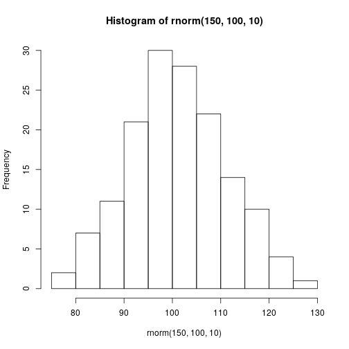
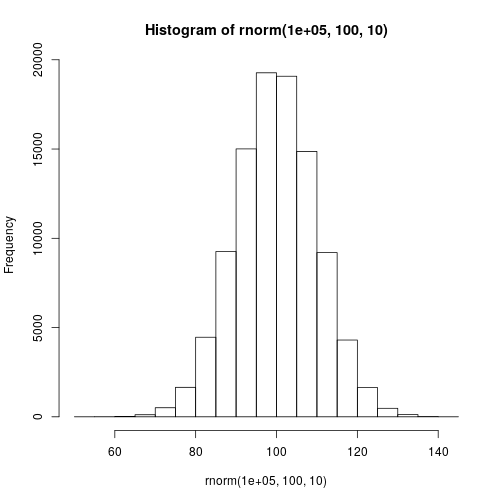

## Geração de dados

A geração de dados é uma ferramenta que amplia as possibilidades de análise de dados. Gerando dados podemos criar cenários de interesse, realizar simulações, e entender melhor o comportamento de funções ou estratégias de programação. Por exemplo, a maioria dos exemplos deste livro são baseados em dados gerados para entender conceitos de programação no R.

### Sequências

Como vimos em capítulos anteriores, a forma mais simples de criar sequências é com `:`.


```r
> 1:5
```

```
[1] 1 2 3 4 5
```

```r
> 7:2
```

```
[1] 7 6 5 4 3 2
```

Porém, o uso de `:` limita-se à criação de sequências que variam de um em um. Com a função `seq` podemos definir a magnitude da variação,


```r
> seq(0, 100, by = 10) # Abreviação: seq(0, 100, 10)
```

```
 [1]   0  10  20  30  40  50  60  70  80  90 100
```

o comprimento da sequência,


```r
> seq(-200, -100, l = 5) # l: abreviação de length.out
```

```
[1] -200 -175 -150 -125 -100
```

ou passar um vetor de comprimento *x* para gerar uma sequência de 1 até *x*.


```r
> vec <- c('a', 'b', 'c')
> length(vec)
```

```
[1] 3
```

```r
> seq(vec) # Mais eficiente: seq_along(vec)
```

```
[1] 1 2 3
```

### Repetições

Em capítulos anteriores também vimos que a função `rep` permite-nos criar repeteições de um elemento,


```r
> rep(1, 5)
```

```
[1] 1 1 1 1 1
```

de mais de um elemento alternadamente,


```r
> rep(1:2, 5)
```

```
 [1] 1 2 1 2 1 2 1 2 1 2
```

ou de mais de um elemento sequencialmente.


```r
> rep(1:2, e = 5) # e: abreviação de each
```

```
 [1] 1 1 1 1 1 2 2 2 2 2
```

### Ordenção

A função `sort` ordena por padrão os números de forma crescente, e as letras alfabeticamente dando precedência às minúsculas. Com o argumento `decreascing` sendo verdadeiro, a forma de ordenação é oposta ao padrão.


```r
> populacao <- c(778, 511, 903, 150)
> sort(populacao)
```

```
[1] 150 511 778 903
```

```r
> sort(populacao, d = T) # d: abreviação de decreascing
```

```
[1] 903 778 511 150
```

```r
> regiao <- c('b', 'a', 'd', 'c')
> sort(regiao)
```

```
[1] "a" "b" "c" "d"
```

```r
> sort(regiao, d = T)
```

```
[1] "d" "c" "b" "a"
```

A função `order` também auxilia no ordenamento de dados, mas no lugar de retornar os valores ordenados, retorna os índices originas ordenados pelo valor dos elementos. Portanto, no vetor `populacao` o primeiro índice será o 4 (menor valor = 150), o segundo índice será o 2 (segundo menor valor = 511) e assim por diante.


```r
> order(populacao)
```

```
[1] 4 2 1 3
```

`order` também tem o argumento `deacreasing`, mas não pode ser abreviado como no caso de `sort`.


```r
> order(populacao, decreasing = T)
```

```
[1] 3 1 2 4
```


A ordenação de índices permite ordenar um ou mais vetores com base em outro vetor. Dessa maneira, podemos ordenar as regiões do exemplo anterior, com base no tamanho populacional.


```r
> regiao[order(populacao)]
```

```
[1] "c" "a" "b" "d"
```

Tratando-se de data frames, `order` permite-nos usar uma ou mais colunas para ordenar as restantes.


```r
> regioes <- data.frame(regiao, populacao, casos = c('sim', 'nao', 'sim', 'sim'))
> regioes[order(regioes$populacao), ]
```

```
  regiao populacao casos
4      c       150   sim
2      a       511   nao
1      b       778   sim
3      d       903   sim
```

```r
> regioes[order(regioes$casos, regioes$populacao), ]
```

```
  regiao populacao casos
2      a       511   nao
4      c       150   sim
1      b       778   sim
3      d       903   sim
```

A função `rank` mostra a posição que cada valor tem, na sequência ordenada de valores. Portanto, no vetor `populacao` a posição do primeiro elemento é a terceira (terceiro menor valor = 778), a segunda 2 (segundo menor valor = 511) e assim por diante.


```r
> rank(populacao)
```

```
[1] 3 2 4 1
```

### Texto

As funções `letters` e `LETTERS` são formas alternativas de gerar letras.


```r
> letters
```

```
 [1] "a" "b" "c" "d" "e" "f" "g" "h" "i" "j" "k" "l" "m" "n" "o"
[16] "p" "q" "r" "s" "t" "u" "v" "w" "x" "y" "z"
```

```r
> LETTERS
```

```
 [1] "A" "B" "C" "D" "E" "F" "G" "H" "I" "J" "K" "L" "M" "N" "O"
[16] "P" "Q" "R" "S" "T" "U" "V" "W" "X" "Y" "Z"
```

```r
> sort(c(letters[1:7], LETTERS[1:7]), d = T)
```

```
 [1] "G" "g" "F" "f" "E" "e" "D" "d" "C" "c" "B" "b" "A" "a"
```

Por outro lado, podemos concatenar caracteres com a função `paste`.


```r
> paste('regiao', 'a')
```

```
[1] "regiao a"
```

```r
> paste('regiao', 1, sep = '-')
```

```
[1] "regiao-1"
```

```r
> paste('regiao', letters, sep = ':')
```

```
 [1] "regiao:a" "regiao:b" "regiao:c" "regiao:d" "regiao:e"
 [6] "regiao:f" "regiao:g" "regiao:h" "regiao:i" "regiao:j"
[11] "regiao:k" "regiao:l" "regiao:m" "regiao:n" "regiao:o"
[16] "regiao:p" "regiao:q" "regiao:r" "regiao:s" "regiao:t"
[21] "regiao:u" "regiao:v" "regiao:w" "regiao:x" "regiao:y"
[26] "regiao:z"
```

O argumento `sep` define o caractere de separação. Para concatenar caracteres sem espaços nem outros caracteres de separação, podemos usar `sep = ''` ou a função `paste0`.


```r
> paste('regiao', 1, sep = '')
```

```
[1] "regiao1"
```

```r
> paste0('regiao', 1)
```

```
[1] "regiao1"
```

O argumento `collapse` colapsa o resultado em um único caractere.


```r
> paste(letters[1:5], 1:5, sep = '_', collapse = '--')
```

```
[1] "a_1--b_2--c_3--d_4--e_5"
```


### Seleção aleatória

Nesta seção usaremos distribuições probabilísticas comuns para gerar dados aleatórios (amostras probabilísticas). Tecnicamente, os dados gerados pelos software estatísticos são pseudoaleatórios, mas isso, assim como a teoria estatística, está além do escopo deste livro.  

Dado um conjunto de dados A, uma amostra é um subconjunto de A. Nas amostras probabilísticas, cada elemento do conjunto A tem uma probabilidade conhecida e diferente de zero, de ser selecionado na amostra. A probabilidade atribuída a cada elemento depende da distribuição probabilística de base.

#### Distribuição uniforme

Com a distribuição uniforme, cada elemento tem a mesma probabilidade de ser selecionado. Para obtermos uma amostra de uma distribuição uniforme podemos usar a função `runif` especificando o número de elementos (tamanho da amostra) `n` que queremos amostrar e os valores mínimo (`min`) e máximo (`max`) do conjunto de elementos a serem amostrados.


```r
> runif(n = 10, min = -50, max = 50)
```

```
 [1] -32.390062   7.448826 -34.533168 -45.838146  -8.382488
 [6] -32.311678  45.082097  41.735794  26.586496 -20.087438
```

Cada vez que for executado o comando anterior, serão selecionados 10 elementos de um conjunto de números contínuos que vão de -50 a 50. Para obtermos sempre o mesmo resultado, devemos executar a função `set.seed` antes da função que produz resultados aleatórios.


```r
> set.seed(43)
> runif(10, -50, 50)
```

```
 [1]  -1.4962318  41.0766036 -44.2326110  20.5398411 -18.6504901
 [6]   4.3032635  17.9100947   0.6703597 -31.7028303  37.2258511
```

A função `set.seed` é instanciada com um número inteiro e no exemplo anterior o número 43 foi uma escolha arbitrária. Se mudarmos o número os resultados serão diferentes, mas se usarmos sempre o mesmo número, os resultados serão reproduzíveis.  
Para arredondarmos os resultados, podemos usar a função `round`,


```r
> set.seed(43)
> round(runif(10, -50, 50), digits = 3)
```

```
 [1]  -1.496  41.077 -44.233  20.540 -18.650   4.303  17.910
 [8]   0.670 -31.703  37.226
```

```r
> set.seed(43)
> round(runif(10, -50, 50), digits = 0)
```

```
 [1]  -1  41 -44  21 -19   4  18   1 -32  37
```

```r
> set.seed(43)
> round(runif(10, -50, 50))
```

```
 [1]  -1  41 -44  21 -19   4  18   1 -32  37
```

ou as funções `floor` e `ceiling` que arredondam para baixo e para cima respectivamente.


```r
> set.seed(43)
> floor(runif(10, -50, 50))
```

```
 [1]  -2  41 -45  20 -19   4  17   0 -32  37
```

```r
> set.seed(43)
> ceiling(runif(10, -50, 50))
```

```
 [1]  -1  42 -44  21 -18   5  18   1 -31  38
```

A função `sample` também serve para gerar amostras a partir de uma distribuição uniforme. Entretanto, a sintaxe é diferente e os resulatos são números inteiros.


```r
> set.seed(43)
> sample(x = -50:50, size = 10, replace = T)
```

```
 [1]  -2  41 -45  21 -19   4  18   1 -32  38
```

O argumento `x` é o conjunto de elementos a serem amostrados, o argumento `size` é o tamanho da amostra, e o argumento `replace` (abreviado como `r`) indica se a amostra é com ou sem reposição. Em amostras com reposição (`replace = T`) um dado elemento pode ser selecionado mais de uma vez. Em amostras sem reposição um dado elemento pode ser selecionado no máximo uma vez.  

Reparem que os resultados da função `sample` são iguais aos resultados da função `runif` quando nesta última os número negativos são arredondados para baixo e os positivos para cima.  

#### Distribuição normal

A distribuição normal é caracterizada por dois parâmetros que são a média e o desvio padrão. Para uma amostra com base em uma distribuição normal com média 100 e desvio padrão 10, o valor mais provável será 100, e a probabilidade será menor quanto mais distante seja um valor da média (a variação das probabilidades é dado graficamente pela famosa campana de Gauss, cujo pico coincide com a média).  

Supondo que o peso dos animais de uma dada população segue uma distribuição normal com média (`mean`) 100 e desvio padrão (`sd`) 10, podemos sortear 20 pesos dessa população com a função `rnorm`. 


```r
> set.seed(43)
> rnorm(n = 20, mean = 100, sd = 10)
```

```
 [1]  99.62486  84.25396  95.14032 104.65186  90.95902  97.22567
 [7] 103.86434  99.39596  93.13820  80.93863 118.03760  90.33127
[13]  96.46882 111.06937 105.66324 120.64309 114.69278  83.48500
[19] 102.02636  92.79020
```

Se graficarmos a distribuição das frequências dos valores soretados, veremos que o formato se aproxima ao da campana de Gauss. Quanto mais números soretarmos, o formato da distribuição das frequências será mais próximo ao da campana de Gauss.


```r
> set.seed(43)
> hist(rnorm(150, 100, 10))
```



```r
> set.seed(43)
> hist(rnorm(100000, 100, 10))
```



#### Distribuição de Poisson

A distribuição de Poisson é caracterizada por um único parâmetro *lambda*, equivalente à média e ao desvio padrão (a média e o desvio padrão são iguais). Esta distribuição expressa a probabilidade de ocorrência de um dado número de eventos por unidade de espaço ou tempo. Para obtermos uma amostra com base em uma distribuição de Poisson devemos especificar o tamanho da amostra `n` é o parâmetro `lambda` na função `rpois`.  

Se a média de cães por domicílio é 0.88 em um dado município, podemos simular o número de cães em 20 domicílios, usando a distribuição de Poisson correspondente.


```r
> set.seed(43)
> rpois(n = 20, lambda = .88)
```

```
 [1] 1 2 0 1 0 1 1 1 0 2 0 0 1 0 1 1 0 0 0 0
```

#### Distribuição binomial

A distribuição binomial é caracterizada pelos parâmetros *size* e *p*, sendo *size* uma sequência independente de experimentos de Bernoulli. Nesses experimentos os possíveis resultados são sucesso ou fracasso, e os sucessos ocorrem com probabilidade *p*. A independência da sequência implica que o resultado de um experimento não está condicionado pelo resultado de outros experimentos. Com a função `rbinom` podemos especificar esses parâmetros, assim como o tamanho da amostra `n` (a literatura estatística costuma usar a letra *n* para referir-se ao primeiro parâmetro mencionado, porém, na função `rbinom`, `n` representa o tamanho da amostra e `size` é o número de experimentos).  

Se a soroprevalência de uma dada doença é de 15%, podemos criar 10 grupos hipotéticos cada um com 100 animais testados, e a cada grupo atribuir um número animais positivos de acordo com a distribuição binomial correspondente.


```r
> set.seed(43)
> rbinom(n = 10, size = 100, p = .15)
```

```
 [1] 15 20 10 17 13 15 17 15 12 19
```

#### Outras formas de atribuir as probabilidades

A função `sample` permite-nos amostrar sem reposição (por padrão `rapleace = F`) e atribuir probabilidades de seleção diferentes para cada elemento. Em ambos casos, a distribuição probabilística de base deixa de ser uniforme.


```r
> set.seed(43)
> sample(-50:50, 10)
```

```
 [1]  -2  41 -45  19 -20   2  14  -3 -33  30
```

A atribuição de probabilidades é mediada pelo argumento `prob`, que deve ser um vetor de probabilidades com comprimento igual ao número de elementos no conjunto do qual se faz a amostragem. Se a soma das probabilidades em `prob` não é igual a 1, a função normaliza internamente essas probabilidades para que o seja.


```r
> set.seed(43)
> sample(1:3, 20, r = T, prob = c(.9, .4, .5))
```

```
 [1] 1 2 1 3 1 3 3 3 1 2 1 1 3 1 1 3 1 1 1 1
```

### Combinação

As vezes precisamos gerar o total de possíveis combinações de tamanho `m`, de um conjunto `x`. A função `ncombn` faz exatamente isso.


```r
> combn(x = letters[1:3], m = 2)
```

```
     [,1] [,2] [,3]
[1,] "a"  "a"  "b" 
[2,] "b"  "c"  "c" 
```

```r
> combn(letters[1:5], 3)
```

```
     [,1] [,2] [,3] [,4] [,5] [,6] [,7] [,8] [,9] [,10]
[1,] "a"  "a"  "a"  "a"  "a"  "a"  "b"  "b"  "b"  "c"  
[2,] "b"  "b"  "b"  "c"  "c"  "d"  "c"  "c"  "d"  "d"  
[3,] "c"  "d"  "e"  "d"  "e"  "e"  "d"  "e"  "e"  "e"  
```

Dados *n* conjuntos de elementos, a função `expand.grid` gera um data frame com todas as possíveis combinações


```r
> expand.grid(letters[1:3], 1:2)
```

```
  Var1 Var2
1    a    1
2    b    1
3    c    1
4    a    2
5    b    2
6    c    2
```

```r
> expand.grid(letters[1:3], 1:2, LETTERS[1:2])
```

```
   Var1 Var2 Var3
1     a    1    A
2     b    1    A
3     c    1    A
4     a    2    A
5     b    2    A
6     c    2    A
7     a    1    B
8     b    1    B
9     c    1    B
10    a    2    B
11    b    2    B
12    c    2    B
```

Outra função que serve para criar combinações é `outer`, que com dois conjuntos de elementos, gera todas as possíveis combinações, sendo que os elementos são combinados usando uma determinada função.


```r
> outer(letters[1:3], 1:3, FUN = paste)
```

```
     [,1]  [,2]  [,3] 
[1,] "a 1" "a 2" "a 3"
[2,] "b 1" "b 2" "b 3"
[3,] "c 1" "c 2" "c 3"
```

```r
> outer(letters[1:3], 1:3, paste, sep = '-')
```

```
     [,1]  [,2]  [,3] 
[1,] "a-1" "a-2" "a-3"
[2,] "b-1" "b-2" "b-3"
[3,] "c-1" "c-2" "c-3"
```

```r
> outer(1:3, 1:3, '*')
```

```
     [,1] [,2] [,3]
[1,]    1    2    3
[2,]    2    4    6
[3,]    3    6    9
```

