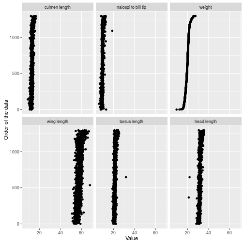
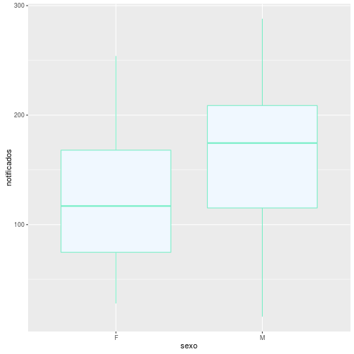

## Gráficos  

### Gramática de gráficos

Existem várias abordagens para criar gráficos no R e o foco aquí é a *gramática de gráficos* implementada no pacote ggplot2. A ideia da gramática dos gráficos é usar geometrias com propriedades estéticas para representar dados em um sistema de coordenadas. Para entendermos melhor a gramática de gráficos, criemos um banco fictício de casos notificados e confirmados durante 200 semanas, com o sexo e o local de ocorrência de cada caso.


```r
> set.seed(12)
> casos <- data.frame(
+   semana = 1:200,
+   notificados = round(seq(50, 250, l = 200) + runif(200, -40, 40)),
+   confirmados = round(seq(5, 25, l = 200) + runif(200, -5, 5)),
+   sexo = c(sample(c('M', 'F'), 100, replace = T),
+     sample(c('M', 'F'), 100, replace = T, prob = c(.8, .2))),
+   local = rep(c('A', 'B'), each = 50)
+   )
```


```r
> str(casos, v = 1)
```

```
'data.frame':	200 obs. of  5 variables:
 $ semana     : int  1 2 ...
 $ notificados: num  16 76 ...
 $ confirmados: num  10 2 ...
 $ sexo       : Factor w/ 2 levels "F","M": 2 2 ...
 $ local      : Factor w/ 2 levels "A","B": 1 1 ...
```

```r
> head(casos)
```

```
  semana notificados confirmados sexo local
1      1          16          10    M     A
2      2          76           2    M     A
3      3          87           5    M     A
4      4          35           9    F     A
5      5          28          10    F     A
6      6          18           7    M     A
```

A partir do banco `casos` podemos graficar a relação entre o número de casos notificados e confirmados usando a função `ggplot`. O primeiro passo é a especificação do banco de dados no argumento `data`, e das variáveis a serem representadas no argumento `mapping`. Este último argumento é definido com a função `aes` que permite especificar as propriedades estéticas que mapearão (representarão) as variáveis.  


```r
> library(ggplot2)
> ggplot(data = casos, mapping = aes(x = notificados, y = confirmados))
```


No gráfico acima, as variáveis `notificados` e `confirmados` foram mapeadas nos eixos `x` e `y` que são duas propriedades estéticas. Entretanto, o valor dessas variáveis para cada observação (semana) não foi graficado porque não especificamos nenhuma geometria. Se o objetivo é criar um gráfico de dispersão (scatterplot) podemos acrescentar a função `geom_point` (reparem no sinal + que acrescenta a função) para usar o ponto como geometria.  


```r
> ggplot(data = casos, mapping = aes(x = notificados, y = confirmados)) +
+   geom_point()
```


Em capítulos anteriores usamos a função `plot` - que não segue os princípios da gramática de gráficos - e aqui podemos usá-la de novo para criar um gráfico equivalente ao anterior.  


```r
> plot(x = casos$notificados, y = casos$confirmados)
```


Por que usar a função `ggplot` se a função `plot` é muito mais simples? Porque é comum criar gráficos com mais informações (legendas, relações multivariadas, etc.) e nesses casos a função `ggplot` é mais versátil e fácil de usar. Por exemplo, para representar o sexo com cores diferentes e criar a legeneda correspondente, só precisamos mapear a variável `sexo` na propriedade estética `color`.


```r
> ggplot(data = casos, aes(x = notificados, y = confirmados, color = sexo)) +
+   geom_point()
```


Embora seja possível criar um gráfico equivalente com a função `plot`, o nível de dificuldade é maior. E conforme aumenta a complexidade dos gráficos, maior a diferença entre as abordagens. Por exemplo, como a gramática de gráficos é simples criar um gráfico da relação entre o o número de casos notificados e confirmados, condicionada no local de ocorrência e o sexo.  


```r
> ggplot(data = casos, aes(x = notificados, y = confirmados)) +
+   geom_point() +
+   facet_grid(local ~ sexo)
```


Criar um gráfico equivalente ao anterior com as funções básicas do R seria um bom exercício para quem está entediado e quer reproduzir com muitas linhas de código o que dá para fazer com poucas. Cabe mencionar o lattice que um pacote básico do R e implementa uma outra abordagem também apropriada para gráficos de diversa complexidade. Porém, o foco aqui é o ggplot2.  

#### Mapeamento de variáveis em propriedades estéticas

Uma das principais fontes de confusão no uso do ggplot2 refere-se à forma de usar as propriedades estéticas. Uma propriedade estética pode ser definida como igual a um determinado valor ou mapear uma variável. Por exemplo, a propriedade estética `color` pode ser definida como igual a `'blue'`


```r
> ggplot(data = casos, mapping = aes(x = notificados, y = confirmados)) +
+   geom_point(color = 'blue')
```


ou mapear a variável `sexo` como feito anteriormente.


```r
> ggplot(data = casos, aes(x = notificados, y = confirmados, color = sexo)) +
+   geom_point()
```


```r
> ggplot(data = casos, aes(x = notificados, y = confirmados)) +
+   geom_point(aes(color = sexo))
```


A propriedade estética sempre mapeará uma variável quando usada dentro da função `aes`, que pode ir tanto na função `ggplot` como nas funções com prefixo `geom_ `.

Ao usar `color = 'blue'` dentro da função `aes`, `blue` passa a ser uma variável que por não existir no banco, gera resultados sem sentido.  


```r
> ggplot(data = casos, aes(x = notificados, y = confirmados, color = 'blue')) +
+   geom_point()
```



Reiterando, a propriedade estética deve ir dentro da função `aes` para mapear variáveis, e nas funções com prefixo `geom_` (e fora da função `aes`) para defini-las como igual a um determinado valor.

### Gráficos de uma variável continua

#### Histograma

Em um histograma, a variável contínua é dividida em intervalos e a quantidade de observações em cada intervalo é representada pela altura de uma barra.  


```r
> his <- ggplot(casos, aes(notificados))
> his + geom_histogram()
```

```
`stat_bin()` using `bins = 30`. Pick better value with
`binwidth`.
```


A mensagem gerada pelo comando acima indica que por padrão foi usado `bins = 30` para criar 30 intervalos. Por tanto, podemos controlar o número de intervalos com o argumento `bins`.  


```r
> his + geom_histogram(bins = 10)
```


Também podemos controlar a amplitude dos intervalos.  


```r
> his + geom_histogram(binwidth = 5)
```


A cor de prenchimento é definida pelo argumento `fill` e a cor de contorno pelo argumento `color`.


```r
> his + geom_histogram(bins = 10, fill = 'white', color = 'green')
```


Para representar a contribuição relativa de cada espécie em cada intervalo, o argumento `fill` deve ser usado como propriedade estética para mapear a variável `Species`. Em outras palavras, `fill` deve ser usado como argumento da função `aes`, e não como argumento de `geom_histogram`.  


```r
> his <- ggplot(casos, aes(notificados, fill = sexo))
> his + geom_histogram(bins = 10)
```


#### Densidade

Os gráficos de densidade representam a densidade probabilística de uma variável continua. A área sob a curva é uma medida de probabilidade e assim, ao dividir a variável em intervalos equidistantes, a probabilidade associada um dado intervalo será maior, quanto maior a altura da curva nesse intervalo. No gráfico abaixo, o eixo *y* representa a densidade probabilística (que pode ser maior do que 1), não a probabilidade em si, e podemos pensar que os intervalos são infinitesimalmente pequenos.


```r
> den <- ggplot(casos, aes(notificados))
> den + geom_density(fill = 'white')
```


Ao mapearmos a variável `Species` na propriedade `fill`, as denisdades sobrepõem-se.


```r
> den <- ggplot(casos, aes(notificados, fill = sexo))
> den + geom_density()
```


Para vissualizar melhor cada uma das densidades podemos controlar a transparência que varia entre 0 e 1.


```r
> den <- ggplot(casos, aes(notificados, fill = sexo, color = sexo))
> den + geom_density(alpha = .5)
```


#### Outras geometrias comuns

* `geom_area`
* `geom_dotplot`
* `geom_freqploy`


### Gráficos de uma variável categórica

#### Barras

Os gráficos de barras representam cada uma das categorias de uma variável. A altura das barras representa a quantidade de observações.  


```r
> ggplot(casos, aes(sexo)) +
+   geom_bar(fill = 'lightblue')
```


A largura (ou separação) das barras é controlada com a propriedade `width`.


```r
> ggplot(casos, aes(sexo)) +
+   geom_bar(width = .5)
```


### Gráficos de duas variáveis continuas

#### Pontos

Os gráficos de pontos ou de dispersão representam com pontos o valor das duas variáveis para cada observação.  


```r
> ggplot(casos, aes(x = notificados, y = confirmados, color = local)) +
+   geom_point()
```


#### Linhas

Nos gráficos de linhas, para cada valor na amplitude de uma variável, existe um valor na outra variável. 


```r
> ggplot(casos, aes(x = semana, y = notificados)) +
+   geom_line()
```


No nosso banco, há 200 semanas e embora o registro de notificações tenha sido semanal, podemos ver que o gráfico anterior associa um número de notificações a qualquer ponto no período de 200 semanas (podemos associar um número de notificações à semana 3.4581). Como as notificações não foram registradas de forma contínua, o número de notificações no transcurso de uma semana, que não foi registrado, foi interpolado linearmente (estimado a partir de uma linha reta entre o número de notificações no começo da semana e o número de notificações no começo da semana seguinte). Isto fica mais claro ao combinarmos um gráfico de pontos e de linhas.


```r
> ggplot(casos, aes(x = semana, y = notificados)) +
+   geom_line() +
+   geom_point(color = 'red')
```


A interpolação linear não é a única forma de estimar o valor de uma variável. Podemos criar gráficos de passos que mantêm constante o valor da variável desde o último ponto de observação até o seguinte


```r
> ggplot(casos, aes(x = semana, y = notificados)) +
+   geom_step()
```


```r
> ggplot(casos, aes(x = semana, y = notificados)) +
+   geom_step() +
+   geom_point(color = 'red')
```


ou usar modelos estatísticos cuja explicação está além do escopo deste livro, mas a título de exemplo para quem tem familiaridade, são simples de incorporar especificando o método na função `geom_smooth`.


```r
> ggplot(casos, aes(x = semana, y = notificados)) +
+   geom_smooth(method = 'lm')
```


### Gráficos de uma variável categórica e uma continua

#### Boxplot

Os boxplot representam a distribuição de uma variável continua em cada uma das categorias da variável categórica. Um boxplot está composto por uma caixa que contém o 50% das observações; a base da caixa representa o quantil 25 (abaixo da base está o 25% das observações), uma linha dentro da caixa representa o quantil 50 ou mediana (abaxo da mediana está o 50% das observações) e o topo da caixa representa o quantil 75 (abaixo do topo está o 75% das observações). Portanto, a caixa contém o 50% dos dados (75% - 25%). Da caixa estendem-se "bigodes" que ajudam a identificar valores extremos (pontos além dos bigodes).


```r
> ggplot(casos, aes(x = sexo, y = notificados)) +
+   geom_boxplot()
```


O gráfico acima sugere a inexistência de valores extremos, pois não há pontos além dos bigodes. Para vermos como seria um boxplot com dados extremos, somemos 300 ao número de casos registrados nas 3 primeiras semanas, criemos os boxplot e depois voltemos aos valores originais.  


```r
> casos$notificados[1:3] <- casos$notificados[1:3] + 300
> ggplot(casos, aes(x = sexo, y = notificados)) +
+   geom_boxplot()
```


```r
> casos$notificados[1:3] <- casos$notificados[1:3] - 300
```

A soma de 300 aos 3 primeiros valores criou 2 valores extremos. Por que dois e não 3? Os valores extremos são os que se estendem além dos bigodes e a extensão dos bigodes é determinada por padrão da seguinte maneira:

O bigode superior vai do topo da caixa até o menor valor entre:  

* Quartil 75 + amplitude interquartil multiplicada * 1.5.
* Maior valor observado.  

O bigode inferior vai da base da caixa até o maior valor entre:  

* Quartil 25 - amplitude interquartil multiplicada * 1.5.
* Menor valor observado.  

Portanto, a soma de 300 fez com que 2 dos 3 primeiros valores fossem maiores do que *quartil 75 + amplitude interquartil multiplicada \* 1.5*.


```r
> quantile(casos$notificados, c(.75, .25))
```

```
   75%    25% 
203.00 101.75 
```

```r
> 203 + (203 - 101.75) * 1.5
```

```
[1] 354.875
```

```r
> casos$notificados[1:3] + 300
```

```
[1] 316 376 387
```

Para facilitar comparação das medianas de duas categorias diferentes, a propriedade `notch` cria entrâncias centradas nas medianas. A não superposição dessas entrâncias no eixo *y*, como no gráfico a seguir, sugere que as medianas são diferentes.


```r
> ggplot(casos, aes(x = sexo, y = notificados)) +
+   geom_boxplot(notch = T)
```


#### Barras

Os gráficos de barras também permitem visualizar a relação entre as categorias de uma variável e o valor de uma variável continua, de tal forma que a altura das barras representa o valor da variável continua. A função `geom_bar` nos permite isso mediante a propriedade `stat` que ao ser definida como `identity` define a altura das barras de cada categoria da variável mapeada em `x`, com base na variável mapeada em `y`.


```r
> ggplot(casos, aes(x = sexo, y = notificados)) +
+   geom_bar(stat = 'identity')
```


#### Outras gemotrias comuns

* `geom_violin`
* `geom_dotplot`

### Gráficos com três variáveis quantitativas

Criemos um banco fictício com coordenadas `x` e `y` variando de -10 a 10, e a cada coordenada atribuamos um valor para representar a concentração de um poluente, de tal forma que quanto mais central a coordenada, menor o valor.


```r
> poluente <- expand.grid(x = seq(-10, 10, l = 50), y = seq(-10, 10, l = 50))
> poluente$pol <- 0 + (poluente$x ^ 2 + poluente$y ^ 2)
```

#### Raster

Nos gráficos de raster ou de retículas, cada coordenada é o centro de uma célula ou pixel e o valor ou atributo de cada coordenada é mapeado em uma escala de cor.


```r
> ggplot(poluente, aes(x, y, fill = pol)) +
+   geom_raster()
```


#### Linhas de contorno

Nos gráficos com linhas de contorno ou isolinhas, cada linha representa um valor da variável mapeada (todas as coordenadas têm o mesmo valor se estão na mesma linha).


```r
> ggplot(poluente, aes(x, y)) +
+   geom_contour(aes(z = pol, color = ..level..))
```


```r
> ggplot(poluente, aes(x, y, fill = pol)) +
+   geom_raster() +
+   geom_contour(aes(z = pol, color = ..level..))
```


### Temas

Além das propriedades estéticas das geometrias, existem outros elementos modificáveis e não dependentes dos dados. O estilo ou *tema* dos gráficos é dado por alguns desses elementos e há temas predefinidos. Ao digitarmos `theme_` e dar um `TAB`, aparecerão os temas disponíveis, entre os quais estão os seguintes:


```r
> ggplot(casos, aes(x = notificados, y = confirmados, color = local)) +
+   geom_point() +
+   theme_bw()
```


```r
> ggplot(casos, aes(x = notificados, y = confirmados, color = local)) +
+   geom_point() +
+   theme_classic()
```


```r
> ggplot(casos, aes(x = notificados, y = confirmados, color = local)) +
+   geom_point() +
+   theme_dark()
```


Para maior controle dos elementos que compõem os eixos e as legendas, devemos usar a função `theme` em conjunto com *funções de elementos* que modificam elementos específicos.

### Eixos

#### Títulos

O título do eixos é dado pelo nome das variáveis mapeadas nas propriedades estéticas e é modificado pelas funções `xlab` e `ylab`.


```r
> ggplot(casos, aes(x = notificados, y = confirmados, color = local)) +
+   geom_point() +
+   xlab('Alfa') +
+   ylab('Beta')
```


Caracteres especiais são interpretados pela função `expression`,


```r
> ggplot(casos, aes(x = notificados, y = confirmados, color = local)) +
+   geom_point() +
+   xlab(expression(alpha)) +
+   ylab(expression(beta))
```


enquanto sub e superescritos são incluídos pela função `bquote`.


```r
> ggplot(casos, aes(x = notificados, y = confirmados, color = local)) +
+   geom_point() +
+   xlab(bquote(alpha[2])) +
+   ylab(bquote(beta^2))
```


O tamanho e a orientação são características do texto do elemento `axis.title`, modificadas pela função `element.text` para esse elemento. `axis.title` e `element.text` devem ser usados dentro da função `theme`.


```r
> ggplot(casos, aes(x = notificados, y = confirmados, color = local)) +
+   geom_point() +
+   theme(axis.title = element_text(size = 25, angle = 0))
```


É possível mudar só um dos eixos e outras características como a fonte (`face`), a justificação horizontal (`hjust`) e vertical (`vjust`), e a cor (`color`).


```r
> ggplot(casos, aes(x = notificados, y = confirmados, color = local)) +
+   geom_point() +
+   theme(axis.title.x = element_text(size = 25, face = 'bold.italic',
+                                     hjust = .9))
```


```r
> ggplot(casos, aes(x = notificados, y = confirmados, color = local)) +
+   geom_point() +
+   theme(axis.title.y = element_text(angle = 0, vjust = .1, color = 'red'))
```


#### Marcas

As características das marcas são definidas pelo elemento `axis.text` e modificadas pela função `element_text`.


```r
> ggplot(casos, aes(x = notificados, y = confirmados, color = local)) +
+   geom_point() +
+   theme(axis.text = element_text(size = 25, angle = 45))
```


```r
> ggplot(casos, aes(x = notificados, y = confirmados, color = local)) +
+   geom_point() +
+   theme(axis.text.x = element_text(color = 'blue'))
```


#### Transposição

Ao acrescentarmos a função `coord_flip`, os eixos são transpostos.


```r
> ggplot(casos, aes(x = notificados, y = confirmados, color = local)) +
+   geom_point() +
+   coord_flip()
```


#### Posição e etiqueta das marcas

Para alterar a posição e a etiqueta devemos usar a função `scale_x_continuous` com variáveis quantitativas e `scale_x_discrete` com variáveis qualitativas. Em qualquer caso, o argumento `breaks` define a posição e `levels` as etiquetas.


```r
> ggplot(casos, aes(x = sexo, y = notificados)) +
+   geom_boxplot(notch = T) +
+   scale_x_discrete(breaks = c('F', 'M'), labels = c('Fêmeas', 'Machos')) +
+   scale_y_continuous(breaks = seq(0, 300, by = 50))
```


```r
> ggplot(casos, aes(x = notificados, y = confirmados, color = local)) +
+   geom_point() +
+   scale_x_continuous(breaks = c(50, 150, 250)) +
+   scale_y_continuous(breaks = seq(0, 30, by = 5))
```


No caso de variáveis qualitativas, também podemos mudar as etiquetas mudando o nome das colunas do banco.

### Legendas

#### Título e marcas

Tanto o título como a posição e a etiqueta das marcas são definidos pelas funções da família `scale_` (por exemplo, `scale_fill_discrete`).


```r
> ggplot(casos, aes(x = notificados, y = confirmados, color = local)) +
+   geom_point() +
+   scale_color_discrete(name = 'Local', breaks = c('A', 'B'), labels = 1:2)
```


As características do texto do título e das marcas são modificadas seguindo a lógica  usada com os eixos.


```r
> ggplot(casos, aes(x = notificados, y = confirmados, color = local)) +
+   geom_point() +
+   theme(legend.title = element_text(size = 25),
+         legend.text = element_text(face = 'bold'))
```


#### Posição

Podemos posicionar a legenda acima (`top`), abaixo (`bottom`) ou aos lados (`left`, `right`).


```r
> ggplot(casos, aes(x = notificados, y = confirmados, color = local)) +
+   geom_point() +
+   theme(legend.position = 'top')
```


Para posicioná-la dentro dentro dentro da área graficada, devemos especificar um par de coordenadas escaladas (cada eixo vai de 0 até 1).


```r
> ggplot(casos, aes(x = notificados, y = confirmados, color = local)) +
+   geom_point() +
+   theme(legend.position = c(.1, .7))
```


Também podemos tirar a legenda.


```r
> ggplot(casos, aes(x = notificados, y = confirmados, color = local)) +
+   geom_point() +
+   theme(legend.position = 'none')
```


### Cores

A definição da cor é dada em termos de preenchimento (`fill`) e de contorno (`colour` ou `color`).  


```r
> ggplot(casos, aes(x = sexo, y = notificados)) +
+   geom_boxplot(fill = 'lightblue', color = 'red')
```


São várias as cores disponíveis e além do nome é possível usar os formatos RGB e hexadecimal. Quanto às cores disponíveis, há 657 opções cujos nomes são listados pela função `colors`.


```r
> str(colors())
```

```
 chr [1:657] "white" "aliceblue" "antiquewhite" ...
```

```r
> colors()[1:10]
```

```
 [1] "white"         "aliceblue"     "antiquewhite" 
 [4] "antiquewhite1" "antiquewhite2" "antiquewhite3"
 [7] "antiquewhite4" "aquamarine"    "aquamarine1"  
[10] "aquamarine2"  
```

```r
> ggplot(casos, aes(x = sexo, y = notificados)) +
+   geom_boxplot(fill = colors()[2], color = colors()[10])
```



As vezes é difícil escolher a cor usando a lista da função `colors`, mas se digitarmos *r color chart* na seção de imagens do google, aparecerão exemplos de cores com seus respectivos nomes, e formatos RGB e hexadecimal.  

Nos exemplos anteriores as cores foram definidas, mas nenhuma variável foi mapeada nas cores (as categorias fêmea e macho ficaram com a mesma cor). Se o objetivo for mapear uma variável em cores mudando o padrão, devemos usar as funções da família `scale_`. Com a função `scale_fill_manual` (`scale_color_manual`) podemos definir a cor para cada categoria.


```r
> ggplot(casos, aes(x = sexo, y = notificados, fill = local)) +
+   geom_boxplot()
```


```r
> ggplot(casos, aes(x = sexo, y = notificados, fill = local)) +
+   geom_boxplot() +
+   scale_fill_manual(values = c('lightblue', 'darkred'))
```


```r
> ggplot(casos, aes(x = sexo, y = notificados, color = local)) +
+   geom_boxplot() +
+   scale_color_manual(values = c('blue', 'green'))
```


No lugar de definirmos manualmente a cor de cada categoria, podemos escolher paletas de cores predefinidas (ver *r color brewer palette* no google), com a função `scale_fill_brewer` (`scale_color_brewer`).


```r
> ggplot(casos, aes(x = sexo, y = notificados, fill = local)) +
+   geom_boxplot() +
+   scale_fill_brewer(palette = 'Dark2')
```


Quando a variável mapeada é quantitativa, devemos usar a função `scale_fill_continuous` (`scale_color_continuous`) e definir os extremos da escala de cor.


```r
> ggplot(poluente, aes(x, y, fill = pol)) +
+   geom_raster() +
+   scale_fill_continuous(low = 'yellow', high = 'red')
```


Para incluir mais de duas cores na escala, podemos definir os extremos com mais de uma cor 


```r
> ggplot(poluente, aes(x, y, fill = pol)) +
+   geom_raster() +
+   scale_fill_continuous(low = c('yellow', 'green'), high = c('black', 'red'))
```


ou usar a função `scale_fill_gradientn` (`scale_color_gradientn`) com escalas de cores predefinidas pelas funções `rainbow`, `topo.colors` ou `terrain.colors`.


```r
> ggplot(poluente, aes(x, y, fill = pol)) +
+   geom_raster() +
+   scale_fill_gradientn(colors = rainbow(4))
```


```r
> ggplot(poluente, aes(x, y, fill = pol)) +
+   geom_raster() +
+   scale_fill_gradientn(colors = topo.colors(4))
```


```r
> ggplot(poluente, aes(x, y, fill = pol)) +
+   geom_raster() +
+   scale_fill_gradientn(colors = terrain.colors(4))
```


### Gráficos multivariados

No começo do capítulo criamos um gráfico multivariado.


```r
> ggplot(data = casos, aes(x = notificados, y = confirmados)) +
+   geom_point() +
+   facet_grid(local ~ sexo)
```


A função `facet_grid` mapeia variáveis qualitativas nas linhas e colunas de uma matriz de gráficos. No exemplo anterior mapeamos o local nas linhas e o sexo nas colunas. Para mapear só nas linhas ou nas colunas, há que colocar um ponto na dimensão que não se quer mapear.


```r
> ggplot(data = casos, aes(x = notificados, y = confirmados)) +
+   geom_point() +
+   facet_grid(. ~ sexo)
```


```r
> ggplot(data = casos, aes(x = notificados, y = confirmados)) +
+   geom_point() +
+   facet_grid(sexo ~ .)
```


