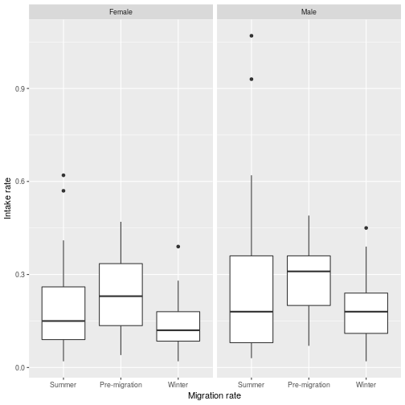
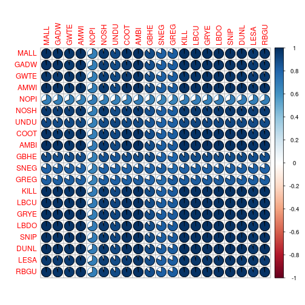
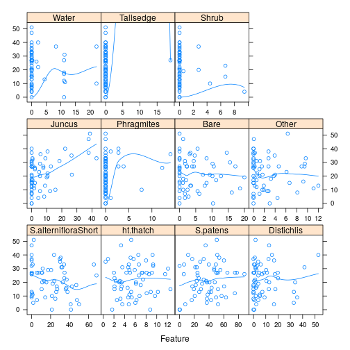
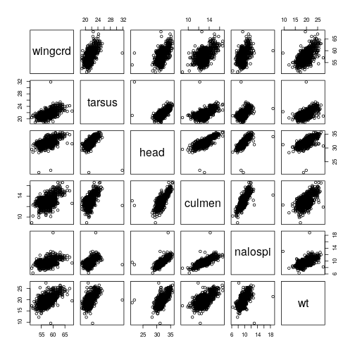

## Protocolo de exploração de dados

Há erros de manipulação e análise que comprometem as conclusões baseadas em dados. Pensando nisso, Zuur e col. propuseram um protocolo de exploração de dados para evitar erros comuns e facilitar a verificação dos pressupostos de métodos estatísticos comuns. O manuscrito [A protocol for data exploration to avoid common statistical problems](http://onlinelibrary.wiley.com/wol1/doi/10.1111/j.2041-210X.2009.00001.x/full) apresenta 8 passos a serem considerados na exploração de dados, assim como bancos de dados e códigos no R para exemplificar a proposta.  

Os códigos do presente capítulo são uma implementação alternativa dos 8 passos que ao serem aplicados nos bancos do artigo, produzem resultados equivalentes. Considero mais simples os códigos do presente capítulo, mas cada leitor terá sua própria opinião ao compará-los com os códigos originais.  

Os aspectos conceituais devem ser consultados no manuscrito, pois o foco aqui é o código. Como já conhecemos a maioria das ferramentas deste capítulo, me limitarei a comentar só as novidades que sejam consideravelmente diferentes.

### Sumário básico


```r
> library(MASS); library(caret); library(GGally); library(car)
> library(ggplot2); library(dplyr); library(tidyr)
> sparrows <- read.table('SparrowsElphick.txt', header = T)
> head(sparrows)
```

```
  wingcrd flatwing tarsus head culmen nalospi   wt bandstat
1    59.0     60.0   22.3 31.2   12.3    13.0  9.5        1
2    54.0     55.0   20.3 28.3   10.8     7.8 12.2        1
3    53.0     54.0   21.6 30.2   12.5     8.5 13.8        1
4    55.0     56.0   19.7 30.4   12.1     8.3 13.8        1
5    55.0     56.0   20.3 28.7   11.2     8.0 14.1        1
6    53.5     54.5   20.8 30.6   12.8     8.6 14.8        1
  initials Year Month Day Location SpeciesCode Sex Age
1        2 2002     9  19        4           1   0   2
2        2 2002    10   4        4           3   0   2
3        2 2002    10   4        4           3   0   2
4        8 2002     7  30        9           1   0   2
5        3 2002    10   4        4           3   0   2
6        7 2004     8   2        1           1   0   2
```

```r
> str(sparrows, vec.len = 1)
```

```
'data.frame':	1295 obs. of  16 variables:
 $ wingcrd    : num  59 54 ...
 $ flatwing   : num  60 55 ...
 $ tarsus     : num  22.3 20.3 ...
 $ head       : num  31.2 28.3 ...
 $ culmen     : num  12.3 10.8 ...
 $ nalospi    : num  13 7.8 ...
 $ wt         : num  9.5 12.2 ...
 $ bandstat   : int  1 1 ...
 $ initials   : int  2 2 ...
 $ Year       : int  2002 2002 ...
 $ Month      : int  9 10 ...
 $ Day        : int  19 4 ...
 $ Location   : int  4 4 ...
 $ SpeciesCode: int  1 3 ...
 $ Sex        : int  0 0 ...
 $ Age        : int  2 2 ...
```

Com `vec.len = 1`, `str` mostra menos valores de cada uma das variáveis.

Junto com `str` e `head`, `summary` é uma das funções básicas para a exploração de dados.


```r
> summary(sparrows)
```

```
    wingcrd         flatwing         tarsus           head      
 Min.   :51.00   Min.   :52.00   Min.   :18.90   Min.   :21.10  
 1st Qu.:56.00   1st Qu.:57.00   1st Qu.:20.80   1st Qu.:31.30  
 Median :58.00   Median :59.00   Median :21.30   Median :31.80  
 Mean   :57.69   Mean   :58.77   Mean   :21.42   Mean   :31.85  
 3rd Qu.:59.00   3rd Qu.:60.00   3rd Qu.:21.80   3rd Qu.:32.30  
 Max.   :68.00   Max.   :68.50   Max.   :31.80   Max.   :35.70  
     culmen        nalospi             wt           bandstat    
 Min.   : 8.9   Min.   : 6.300   Min.   : 9.50   Min.   :1.000  
 1st Qu.:12.5   1st Qu.: 9.100   1st Qu.:18.50   1st Qu.:1.000  
 Median :13.0   Median : 9.400   Median :19.90   Median :1.000  
 Mean   :13.0   Mean   : 9.527   Mean   :19.76   Mean   :1.036  
 3rd Qu.:13.4   3rd Qu.: 9.800   3rd Qu.:20.85   3rd Qu.:1.000  
 Max.   :16.6   Max.   :18.800   Max.   :27.50   Max.   :2.000  
    initials          Year          Month             Day       
 Min.   :0.000   Min.   :2002   Min.   : 5.000   Min.   : 1.00  
 1st Qu.:2.000   1st Qu.:2002   1st Qu.: 6.000   1st Qu.: 7.00  
 Median :3.000   Median :2003   Median : 7.000   Median :13.00  
 Mean   :3.893   Mean   :2003   Mean   : 6.827   Mean   :14.65  
 3rd Qu.:6.000   3rd Qu.:2003   3rd Qu.: 7.000   3rd Qu.:23.00  
 Max.   :9.000   Max.   :2004   Max.   :10.000   Max.   :31.00  
    Location       SpeciesCode         Sex             Age       
 Min.   : 1.000   Min.   :1.000   Min.   :0.000   Min.   :1.000  
 1st Qu.: 7.000   1st Qu.:1.000   1st Qu.:4.000   1st Qu.:1.000  
 Median : 8.000   Median :1.000   Median :4.000   Median :1.000  
 Mean   : 7.494   Mean   :1.136   Mean   :3.419   Mean   :1.164  
 3rd Qu.: 9.000   3rd Qu.:1.000   3rd Qu.:4.000   3rd Qu.:1.000  
 Max.   :11.000   Max.   :3.000   Max.   :5.000   Max.   :2.000  
```

### Detecção de outliers

#### Box plot

Os boxplot dentro do pacote `ggplot2` são conceituados para representar uma variável qualitativa e uma quantitativa. Portanto, é necessário instanciar os argumentos `x` e `y` na função `aes`. Quando o objetivo é criar um boxplot de uma variável quantitativa sem considerar outra qualitativa, devemos instanciar `x` de qualquer forma e posteriormente omitir a etiqueta e marca do respectivo eixo.


```r
> ggplot(sparrows, aes(x = 1, y = wingcrd)) +
+   geom_boxplot() +
+   xlab('') +
+   ylab('Wing length (mm)') +
+   theme(axis.ticks.x = element_blank(),
+         axis.text.x = element_blank())
```


Nesses casos, a abordagem convencional do R é bem mais simples.


```r
> boxplot(sparrows$wingcrd, ylab = 'Wing length (mm)')
```


#### Dotplot


```r
> ggplot(sparrows, aes(wingcrd, 1:nrow(sparrows))) +
+   geom_point() +
+   xlab('Wing length (mm)') +
+   ylab('Order of data')
```


```r
> ggplot(sparrows, aes(wingcrd)) +
+   geom_dotplot(method = 'histodot', binwidth = 1, dotsize = .3) +
+   xlab('Wing length (mm)') +
+   ylab('Percentage')
```


```r
> sparrows2 <- sparrows %>%
+   mutate(order = 1:nrow(sparrows)) %>%
+   select(order, wingcrd, tarsus, head, culmen, nalospi, wt)
> head(sparrows2)
```

```
  order wingcrd tarsus head culmen nalospi   wt
1     1    59.0   22.3 31.2   12.3    13.0  9.5
2     2    54.0   20.3 28.3   10.8     7.8 12.2
3     3    53.0   21.6 30.2   12.5     8.5 13.8
4     4    55.0   19.7 30.4   12.1     8.3 13.8
5     5    55.0   20.3 28.7   11.2     8.0 14.1
6     6    53.5   20.8 30.6   12.8     8.6 14.8
```


```r
> sparrows2 <- gather(sparrows2, variable, value, -order)
> head(sparrows2)
```

```
  order variable value
1     1  wingcrd  59.0
2     2  wingcrd  54.0
3     3  wingcrd  53.0
4     4  wingcrd  55.0
5     5  wingcrd  55.0
6     6  wingcrd  53.5
```


```r
> ggplot(sparrows2, aes(value, order)) +
+   geom_point() +
+   facet_wrap(~ variable) +
+   xlab('Wing length (mm)') +
+   ylab('Order of the data')
```


```r
> sparrows2$variable <- factor(sparrows2$variable,
+                             levels = c('culmen', 'nalospi', 'wt',
+                                        'wingcrd', 'tarsus', 'head'),
+                             labels = c('culmen length', 'nalospi to bill tip',
+                                        'weight', 'wing length',
+                                        'tarsus length', 'head length'))
```


```r
> ggplot(sparrows2, aes(value, order)) +
+   geom_point() +
+   facet_wrap(~ variable) +
+   xlab('Value') +
+   ylab('Order of the data')
```


### Homogeneidade de variâncias

#### Box plot


```r
> godwits <- read.table('Godwits.txt', header = T)
> str(godwits)
```

```
'data.frame':	330 obs. of  9 variables:
 $ RECORD    : int  1 2 3 4 5 6 7 8 9 10 ...
 $ DAY       : int  5 5 5 5 5 5 5 6 6 6 ...
 $ MONTH     : int  1 1 1 1 1 1 1 2 2 2 ...
 $ YEAR      : int  97 97 97 97 97 97 97 97 97 97 ...
 $ LOCATION  : int  0 0 0 0 0 0 0 0 1 0 ...
 $ AGE       : int  0 0 0 0 0 0 0 0 0 0 ...
 $ SEX       : int  0 0 0 0 0 0 0 0 0 0 ...
 $ PERIOD    : num  0 0 0 0 0 0 0 1 1 1 ...
 $ mgconsumed: num  0.07 0.16 0.25 0.07 0.14 0.26 0.1 0.21 0.11 0.09 ...
```

A variável `SEX` tem três valores diferentes (`0`, `1` e `2`). ). O `1` representa as fêmeas e o `2` os machos. Para omitirmos o `0` e atribuir etiquetas transformaremos a variável em um fator só com os níveis de interesse (`1` e `2`).


```r
> godwits <- godwits %>%
+   mutate(SEX = factor(SEX, levels = c(1, 2),
+                       labels = c('Female', 'Male')),
+          PERIOD = factor(PERIOD, levels = c(0, 1, 2),
+                          labels = c('Summer', 'Pre-migration', 'Winter')))
```

As observações com `0` são representadas com `NA`.


```r
> ggplot(godwits, aes(PERIOD, mgconsumed, fill = SEX)) +
+   geom_boxplot() +
+   xlab('Migration rate') +
+   ylab('Intake rate')
```


A função `na.omit` omite todas as observações com `NA`.


```r
> ggplot(na.omit(godwits), aes(PERIOD, mgconsumed, fill = SEX)) +
+   geom_boxplot() +
+   xlab('Migration rate') +
+   ylab('Intake rate')
```


```r
> ggplot(na.omit(godwits), aes(PERIOD, mgconsumed)) +
+   geom_boxplot() +
+   facet_wrap(~ SEX) +
+   xlab('Migration rate') +
+   ylab('Intake rate')
```



### Distribuição normal

#### Histograma


```r
> str(sparrows)
```

```
'data.frame':	1295 obs. of  16 variables:
 $ wingcrd    : num  59 54 53 55 55 53.5 55.5 55 54 55 ...
 $ flatwing   : num  60 55 54 56 56 54.5 57 56 56 56 ...
 $ tarsus     : num  22.3 20.3 21.6 19.7 20.3 20.8 20.3 20.9 21.4 20.4 ...
 $ head       : num  31.2 28.3 30.2 30.4 28.7 30.6 29.5 30 29.8 29.8 ...
 $ culmen     : num  12.3 10.8 12.5 12.1 11.2 12.8 11.5 11.7 11 11.2 ...
 $ nalospi    : num  13 7.8 8.5 8.3 8 8.6 8.5 8.5 8.7 8.1 ...
 $ wt         : num  9.5 12.2 13.8 13.8 14.1 14.8 15 15 15.1 15.1 ...
 $ bandstat   : int  1 1 1 1 1 1 1 1 1 1 ...
 $ initials   : int  2 2 2 8 3 7 3 3 1 2 ...
 $ Year       : int  2002 2002 2002 2002 2002 2004 2002 2002 2002 2002 ...
 $ Month      : int  9 10 10 7 10 8 10 10 10 10 ...
 $ Day        : int  19 4 4 30 4 2 4 2 21 2 ...
 $ Location   : int  4 4 4 9 4 1 4 5 7 5 ...
 $ SpeciesCode: int  1 3 3 1 3 1 3 3 3 3 ...
 $ Sex        : int  0 0 0 0 0 0 0 0 0 0 ...
 $ Age        : int  2 2 2 2 2 2 2 1 2 2 ...
```

```r
> sparrows$Month <- factor(sparrows$Month,
+                         levels = c(5, 6, 7, 8, 9, 10),
+                         labels = c('May', 'June', 'July', 'August',
+                                    'Sep', 'Oct'))
```


```r
> ggplot(filter(sparrows, Month == 'June' | Month == 'July' | Month == 'August'),
+        aes(wt)) +
+   geom_histogram(color = 'gray') +
+   xlab('Weight (g)') +
+   ylab('Frequency')
```

```
`stat_bin()` using `bins = 30`. Pick better value with
`binwidth`.
```


```r
> ggplot(filter(sparrows, Month == 'June' | Month == 'July' | Month == 'August'),
+        aes(wt)) +
+   geom_histogram(color = 'gray') +
+   facet_wrap(~ Month, ncol = 1) +
+   xlab('Weight (g)') +
+   ylab('Frequency')
```

```
`stat_bin()` using `bins = 30`. Pick better value with
`binwidth`.
```


### Exceso de zeros

#### Proporção de zeros


```r
> rice_field <- read.table(file='ElphickBirdData.txt', header = T)
```

Apos calcular a frequência de valores únicos do produto entre `AREA` e `AQBIRDS` com a função `table`,


```r
> freqs <- table(round(rice_fieldAREA * rice_fieldAQBIRDS))
```

```
Error in table(round(rice_fieldAREA * rice_fieldAQBIRDS)): object 'rice_fieldAREA' not found
```

```r
> freqs[1:5]
```

```

  0   1   2   3   4 
718 131 108  46  52 
```

a proporção de zeros é a divisão do total de zeros pelo número observações no banco.


```r
> freqs[1] / nrow(rice_field)
```

```
        0 
0.3528256 
```


```r
> ggplot(rice_field, aes(round(AREA * AQBIRDS))) +
+   geom_histogram(binwidth = 1) +
+   xlim(c(-1, 100))
```

```
Warning: Removed 400 rows containing non-finite values (stat_bin).
```


#### Correlograma

Os correlogramas são tipicamente usados para representar matrizes de correlação. Entretanto, servem para outros propósitos como ilustrado no manuscrito e a continuação.


```r
> especies <- rice_field[, 14:62]
> abundancia <- colSums(especies > 0, na.rm = T)
> especies2 <- especies[, abundancia > 40]
> cls <- ncol(especies2)
> prop_zeros <- matrix(ncol = cls, nrow = cls)
> 
> # Para reproduzir a matriz que gera o gráfico do artigo, o laço de repetição 
> # é baseado no objeto especies, mas pela lógica das linhas anteriores
> # (que reproduzem as linhas correspondentes do material suplementar),
> # acredito que deveria ser o obetjo especies2.
> for (i in 1:cls) {
+   for (j in 1:cls){
+     prop_zeros[i, j] <- sum(especies[, i] == 0 & especies[, j] == 0, na.rm = T)
+   }
+ }
> 
> prop_zeros <- prop_zeros / nrow(especies2)
> rownames(prop_zeros) <- names(especies2)
> colnames(prop_zeros) <- names(especies2)
```


```r
> library(corrplot)
> corrplot(prop_zeros, method = 'pie')
```



Como o triângulo inferior é uma imagem especular do superior, é desnecessário apresentar a matriz completa.


```r
> corrplot(prop_zeros, method = 'pie', type = 'lower')
```


### Colinearidade


```r
> sparrows3 <- read.table(file = 'VegSamplesV1.txt', header = T)
```

#### VIF


```r
> mod1 <- lm(Banded ~ Avgmaxht + Avgdens + ht.thatch + S.patens +
+               Distichlis + S.alternifloraShort + S.alternifloraTall +
+               Juncus + Bare + Other + Phragmites + Shrub + Tallsedge +
+                Water, data = sparrows3)
> summary(mod1)
```

```

Call:
lm(formula = Banded ~ Avgmaxht + Avgdens + ht.thatch + S.patens + 
    Distichlis + S.alternifloraShort + S.alternifloraTall + Juncus + 
    Bare + Other + Phragmites + Shrub + Tallsedge + Water, data = sparrows3)

Residuals:
    Min      1Q  Median      3Q     Max 
-19.142  -5.431   1.011   5.240  18.634 

Coefficients:
                      Estimate Std. Error t value Pr(>|t|)  
(Intercept)         -1.612e+02  8.780e+01  -1.836   0.0730 .
Avgmaxht             4.195e-01  3.548e-01   1.183   0.2432  
Avgdens              6.158e-02  1.719e-01   0.358   0.7219  
ht.thatch            8.427e-04  6.241e-01   0.001   0.9989  
S.patens             1.626e+00  8.562e-01   1.899   0.0640 .
Distichlis           1.703e+00  8.558e-01   1.990   0.0527 .
S.alternifloraShort  1.668e+00  8.462e-01   1.971   0.0549 .
S.alternifloraTall   1.449e+00  8.521e-01   1.700   0.0960 .
Juncus               2.009e+00  8.354e-01   2.405   0.0203 *
Bare                 1.620e+00  8.615e-01   1.880   0.0666 .
Other                1.800e+00  9.807e-01   1.836   0.0730 .
Phragmites           1.851e+00  1.003e+00   1.846   0.0715 .
Shrub                6.300e-02  1.248e+00   0.050   0.9600  
Tallsedge            1.471e+00  1.172e+00   1.255   0.2160  
Water                2.092e+00  1.070e+00   1.955   0.0568 .
---
Signif. codes:  0 '***' 0.001 '**' 0.01 '*' 0.05 '.' 0.1 ' ' 1

Residual standard error: 10.45 on 45 degrees of freedom
Multiple R-squared:  0.393,	Adjusted R-squared:  0.2041 
F-statistic: 2.081 on 14 and 45 DF,  p-value: 0.03214
```

```r
> vif(mod1)
```

```
           Avgmaxht             Avgdens           ht.thatch 
           6.120018            3.206401            1.671224 
           S.patens          Distichlis S.alternifloraShort 
         159.350658           53.754540          121.463782 
 S.alternifloraTall              Juncus                Bare 
         159.382860           44.995377           12.058665 
              Other          Phragmites               Shrub 
           5.817015            3.749027            2.781804 
          Tallsedge               Water 
           4.409398           17.067777 
```

```r
> cbind(vif(mod1))
```

```
                          [,1]
Avgmaxht              6.120018
Avgdens               3.206401
ht.thatch             1.671224
S.patens            159.350658
Distichlis           53.754540
S.alternifloraShort 121.463782
S.alternifloraTall  159.382860
Juncus               44.995377
Bare                 12.058665
Other                 5.817015
Phragmites            3.749027
Shrub                 2.781804
Tallsedge             4.409398
Water                17.067777
```

A seguinte estrutura de controle elimina sequencialmente a covariável com o maior VIF até que o maior VIF seja menor do que 3. `form` é um caractere que representa a fórmula da regressão e para incluí-lo como argumento de `lm` devemos usar a função `as.formula`. O código deve ser modificado antes de ser usado com variáveis explicativas qualitativas.


```r
> vifs <- sort(vif(mod1), d = T)
> while(vifs[1] > 3) {
+     form <- paste('Banded', '~', paste0(names(vifs[-1]), collapse = ' + '))
+     mod2 <- lm(as.formula(form), sparrows3)
+     vifs <- sort(vif(mod2), d = T)
+ }
> summary(mod2)
```

```

Call:
lm(formula = as.formula(form), data = sparrows3)

Residuals:
     Min       1Q   Median       3Q      Max 
-19.1448  -6.3075   0.4815   7.2374  20.0593 

Coefficients:
                    Estimate Std. Error t value Pr(>|t|)    
(Intercept)          9.93887    8.38424   1.185 0.241685    
S.patens             0.08011    0.08162   0.982 0.331243    
S.alternifloraShort  0.12045    0.11375   1.059 0.294972    
Juncus               0.59087    0.14415   4.099 0.000159 ***
Distichlis           0.15929    0.13794   1.155 0.253875    
ht.thatch            0.13163    0.59680   0.221 0.826366    
Other                0.03050    0.45018   0.068 0.946264    
Phragmites           0.65102    0.58768   1.108 0.273473    
Bare                 0.03854    0.27935   0.138 0.890862    
Shrub               -1.59457    0.81712  -1.951 0.056853 .  
Tallsedge            0.48892    0.61606   0.794 0.431324    
Water                0.11326    0.28638   0.395 0.694233    
---
Signif. codes:  0 '***' 0.001 '**' 0.01 '*' 0.05 '.' 0.1 ' ' 1

Residual standard error: 10.61 on 48 degrees of freedom
Multiple R-squared:  0.3331,	Adjusted R-squared:  0.1802 
F-statistic: 2.179 on 11 and 48 DF,  p-value: 0.03169
```

#### Seleção por AIC (stepwise)


```r
> mod3 <- stepAIC(mod2, trace = 0)
> summary(mod3)
```

```

Call:
lm(formula = Banded ~ Juncus + Shrub, data = sparrows3)

Residuals:
    Min      1Q  Median      3Q     Max 
-19.022  -7.495   1.283   7.978  20.978 

Coefficients:
            Estimate Std. Error t value Pr(>|t|)    
(Intercept)  19.0220     1.5944  11.930  < 2e-16 ***
Juncus        0.5354     0.1204   4.445 4.11e-05 ***
Shrub        -1.3237     0.7240  -1.828   0.0727 .  
---
Signif. codes:  0 '***' 0.001 '**' 0.01 '*' 0.05 '.' 0.1 ' ' 1

Residual standard error: 10.1 on 57 degrees of freedom
Multiple R-squared:  0.2822,	Adjusted R-squared:  0.2571 
F-statistic: 11.21 on 2 and 57 DF,  p-value: 7.858e-05
```

### Relação entre variáveis

#### Gráfico de dispersão e linha de ajuste (modelo não linear)


```r
> featurePlot(sparrows3[, names(vifs)], sparrows3$Banded,
+             type = c('p', 'smooth'))
```



#### Correlograma


```r
> pairs(sparrows[, c(1, 3, 4, 5, 6, 7)])
```



```r
> ggpairs(sparrows[, c(1, 3, 4, 5, 6, 7)])
```


### Interação

#### Gráfico de dispersão e linha de ajuste (modelo não linear)


```r
> sparrows4 <- filter(sparrows, SpeciesCode == 1 & Sex != '0' & wingcrd < 65)
> sparrows4$Sex <- factor(sparrows4$Sex, levels = c(4, 5),
+                         labels = c('Male', 'Female'))
> 
> ggplot(sparrows4, aes(wingcrd, wt)) +
+   geom_point() +
+   stat_smooth(method = 'lm', se = F) +
+   facet_grid(Sex ~ Month)
```


### Independência temporal do desfecho

#### Linhas


```r
> waders <- read.table(file = 'wader.txt', header = T)
> 
> ggplot(waders, aes(1:25, C.fuscicolis)) +
+   geom_line() +
+   xlab('Time (2 weeks)') +
+   ylab('C. fuscicollis abundance')
```


```r
> ggplot(waders, aes(1:25, L.dominicanus)) +
+   geom_line() +
+   xlab('Time (2 weeks)') +
+   ylab('L. dominicanus abundance')
```


#### Gráficos de autocorrelação


```r
> acf(waders$C.fuscicolis, main = 'C. fuscicollis ACF')
```


```r
> acf(waders$L.dominicanus, main = 'L. dominicanus ACF')
```


