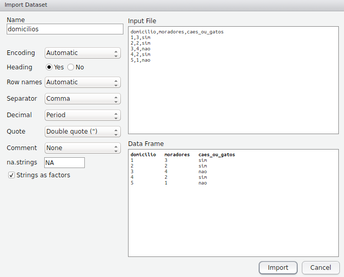

```{r knitsetup, echo=FALSE, results='hide', warning=FALSE, message=FALSE, cache=FALSE}
library(knitr)
opts_knit$set(base.dir='./')
opts_chunk$set(prompt=TRUE, comment='', fig.path='figures/')
options(width = 66)
```

## Importação e exportação de arquivos

Uma forma comum de estruturar os dados é em tabelas com linhas e colunas, sendo que cada linha corresponde a uma observação, e cada coluna a uma variável medida nas observações. Por exemplo, na tabela a seguir a unidade de observação é o domicílio, há cinco observações, e duas variáveis medidas em cada observação.


| domicilio | moradores | caes\_ou\_gatos |
|---|---|---|
| 1 | 3 | sim |
| 2 | 2 | sim |
| 3 | 4 | nao |
| 4 | 2 | sim |
| 5 | 1 | nao |

Editores de planilhas como o Excel o ou Calc são uma alternativa simples e útil para criar tabelas como a anterior, quando a quantidade de dados não compromete a capacidade de processamento e armazenamento. Embora seja possível importar diretamente no R os dados armazenados em uma planilha de Excel, é mais comum salvar os dados em um arquivo CSV para depois importá-los.

Nos arquivos CSV, as tabelas são armazenadas em formato de texto, sendo que cada linha continua sendo uma observação, e as variáveis medidas em cada observação estão separadas por "," ou ";". Assim, o conteúdo da tabela anterior em um arquivo CSV separado por vírgulas seria visualizado em um editor de texto da seguinte maneira:

domicilio,moradores,caes\_ou\_gatos  
1,3,sim  
2,2,sim  
3,4,nao  
4,2,sim  
5,1,nao  

Ao criarmos uma tabela como a primeira em um editor de planilhas, podemos salvar o conteúdo em um arquivo CSV, usando a opção *salvar como*, nomeando o arquivo como *domicilios* (por exemplo), e escolhendo a extensão CSV (em Excel escolher *CSV (separado por vírgulas) (\*.csv)* no campo *Tipo*; em Calc escolher *Texto CSV (.csv)* no campo *Todos os formatos*).  

### Importação

Se no painel *Files* do RStudio escolhermos o diretório em que foi salvo o arquivo, este último aparecerá listado. Se esse diretório não for o diretório de trabalho, podemos defini-lo como tal usando a janela *More* e a opção *Set as Working Directory*. Não é necessário que o diretório com os arquivos seja o diretório de trabalho, mas isso facilita o uso de funções como a `read.csv` que importa o conteúdo de arquivos CSV.  

Ao usarmos o nome do arquivo (domicilios.csv) como argumento da função `read.csv` e designar o nome `domicilios` ao resultado da função, o conteúdo do arquivo fica armazenado em um data frame com o nome `domicilios`.

```{r}
(domicilios <- read.csv('domicilios.csv'))
```

Se o comando anterior gera o seguinte resultado, é porque o delimitador do arquivo CSV é ";" e não ",". Isso acontece em alguns computadores cuja configuração em português usa ";" como delimitador padrão. 

```{r,echo=FALSE}
read.csv('domicilios2.csv')
```

Nesses casos, podemos usar a função `read.csv2` cujo separador padrão é ";", ou usar a função `read.csv` e definir  o argumento `sep` como ";".

```{r, eval=FALSE}
read.csv2('domicilios.csv')
read.csv('domicilios.csv', sep = ';')
```

Tanto, `read.csv` como `read.csv2` são versões específicas para arquivos CSV, simplificadas a partir da função `read.table`. Com esta última função precisamos definir outros argumentos como para importar o arquivo (como o arquivo tem cabeçalho, `header = TRUE`).  

```{r}
read.table('domicilios.csv', header = TRUE, sep = ',')
```

A vantagem de `read.table` é que além de importar arquivos CSV, importa outras extensões como TXT.  

#### Interface do RStudio

O RStudio tem uma interface para importar arquivos. No painel *Envorinment*, janela *Import Daset*, a opção *From Local File* abre a seguinte interface que permite definir várias opções, visualizar o arquivo de entrada e visualizar a forma em o arquivo será importado.  

  
<br>

#### Caracteres especiais

Se criamos um arquivo *dom* semelhante ao arquivo *domicilios*, mas com acentos e espaços  

| domicílio | moradores | cães ou gatos |
|---|---|---|
| 1 | 3 | sim |
| 2 | 2 | sim |
| 3 | 4 | não |
| 4 | 2 | sim |
| 5 | 1 | não |

as tentativas de importação anteriores podem gerar o seguinte erro se o sistema de codificação definido como padrão no RStudio não reconhece caracteres especiais:

```{r, error=TRUE}
read.csv('dom.csv')
```

Se eliminarmos o cabeçalho com o argumento `header`, o arquivo é importado, mas o cabeçalho é considerado como mais uma linha e os caracteres especiais não são adequadamente representados.  

```{r}
read.csv('dom.csv', header = FALSE)
```

Embora seja possível especificar a codificação *latin1* para reconhecer caracteres do português, é preferível evitar caracteres especiais nos bancos de dados.  

```{r}
read.csv('dom.csv', encoding = 'latin1')
```

### Exportação

Um data frame pode ser exportado para um arquivo CSV com a função `write.csv`, especificando o nome do data frame e o nome do arquivo a ser criado. Por padrão, a função `write.csv` acrescenta uma coluna que numera as linhas, mas isso pode ser prevenido com o argumento `row.names`.
```{r, eval=FALSE}
write.csv(domicilios, 'domicilios2.csv', row.names = FALSE)
```

Assim como na importação, `write.csv` e `write.csv2` são versões simplificadas de `write.table`.  

### Outras extensões

Arquivos com extensão de outros programas podem ser importados com funções dos pacotes *Hmisc* e *foreign*, entre outros. Por exemplo, se o arquivo domicílios tivesse a extensão do software *STATA* ou *SPSS*, a importação seria da seguinte maneira.

```{r, eval=FALSE}
library(foreign)
domicilios <- read.dta('domicilios') # STATA
domicilios <- read.spss('domicilios') # SPSS
```
